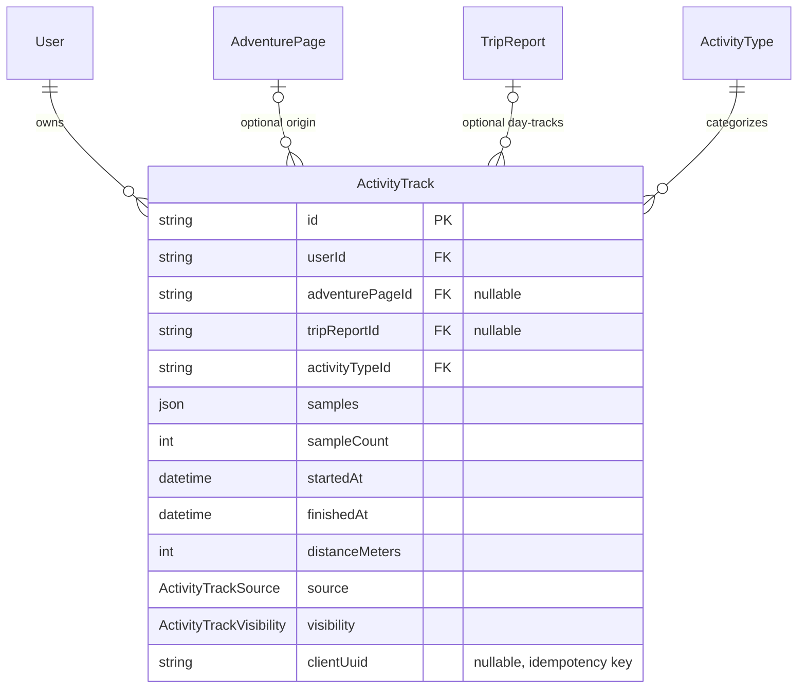

# Activity tracks — personal recordings, file import, trail contribution

A user-owned, private-by-default record of a hike/ride/etc. — the Strava-analogue geometry `TripReport` never had — plus a GPX/KML/KMZ/GeoJSON import pipeline and a path to promote a recording into a public `Trail`. Companion to FEATURE.md §4 (`Trail`/`Spot`, the tables a track can feed) and §5 (`TripReport`, which gains a geometry it never had) and TRAIL_ELEVATION.md (shares its parser module and the sample-sidecar pattern; extends its `TrailSource` enum and resolves its open multi-`<trkseg>` question). Depends on nothing else being built first. Buildable now — no mobile app required; the existing web app can upload a GPX from maps.me/Strava/Garmin today. Design-process record: TRACKS_AND_MOBILE_PLAN.md.

**Status**: built (Milestone 2 Phase 16, together with TRAIL_ELEVATION.md - see FEATURE.md §1), with three pieces deliberately scoped out of this round and named below rather than silently dropped: `GET /adventure-pages/:slug/offline-bundle` (its only real consumer is a future mobile client, and mobile stays out of Milestone 2 - see MOBILE_CLIENT.md); the `ST_DWithin` proximity query (named as "also needed" but not tied to a concrete endpoint this round); and the public UI for `propose-trail-update` (the endpoint is built and tested, but the contribute-a-track page only wires up `promote-to-trail` - proposing an update to an *existing* trail needs a trail picker the UI doesn't have yet). Waypoint→`Spot` candidates and `TripReport`'s "attach a day's track" picker (both named below) are also not built.

## Scope

This system has no concept of personal geodata. Every geometry row today (`Trail`, `Spot`) is `AdventurePage`-scoped, publicly readable, wiki-editable by anyone signed in, and peer-confirmed. A recorded activity is the opposite on all four axes: private by default, owned by one user, immutable testimony rather than an editable claim, and its timestamps are the entire point rather than something stripped for privacy. `TripReport` — the existing Strava-analogue, carrying `dateCompleted`, cost, media, kudos, comments — has zero geometry, not even a start coordinate, so a recorded track currently has nowhere to live.

Not designed here: the mobile client itself (MOBILE_CLIENT.md), DEM/SRTM elevation (TRAIL_ELEVATION.md's boundary — a track's elevation comes only from what the source file supplied), OSM-way import (avoids ODbL share-alike and route conflation; file-based formats only).

## Core design decision: a new table, not a nullable `Trail.userId`

| | `Trail` (exists) | `ActivityTrack` (new) |
|---|---|---|
| Ownership | adventure-page-scoped, wiki-editable | user-owned |
| Mutability | edited in place / revisioned | immutable — a record of what happened |
| Trust model | peer-confirmed | none — testimony, not a claim |
| Timestamps | stripped for privacy | the entire point |
| Visibility | always public | private by default |

Overloading `Trail` with a nullable `userId` fights all five rows at once. CLAUDE.md's own convention — prefer one duplicated-but-simple table over a shared/polymorphic one, precedent `Media` vs. `TripReportMedia` and three separate `*Confirmation` tables — says duplicate. And "no verification tier, it's a personal account not a fact-checked claim" is exactly FEATURE.md §5's reasoning for why `TripReport` has no trust tier at all.

## Schema (additions to `prisma/schema.prisma`)

```prisma
enum ActivityTrackVisibility { PRIVATE  PUBLIC }
enum ActivityTrackSource     { RECORDED  IMPORTED }

model ActivityTrack {
  id                 String   @id @default(uuid())
  userId             String
  user               User     @relation(fields: [userId], references: [id], onDelete: Cascade)

  // Nullable, unlike TripReport.adventurePageId - recording an unlisted
  // route is the case that grows the map. SetNull, not Cascade: deleting a
  // page must not destroy someone's personal record of their own hike.
  adventurePageId    String?
  adventurePage      AdventurePage? @relation(fields: [adventurePageId], references: [id], onDelete: SetNull)
  // Many tracks per report - a 12-day trek is 12 daily tracks, one story.
  tripReportId       String?
  tripReport         TripReport? @relation(fields: [tripReportId], references: [id], onDelete: SetNull)

  activityTypeId     String
  activityType       ActivityType @relation(fields: [activityTypeId], references: [id], onDelete: Restrict)
  name               String?
  notes              String?

  // Simplified path, for map rendering and spatial queries only. Full-fidelity
  // series lives in `samples` - the same sidecar split TrailElevationProfile
  // uses, for the same reason: geometry(LineString, 4326) forbids Z and M.
  geometry           Unsupported("geometry(LineString, 4326)")
  // [{ t: <s from startedAt>, d: <m along path>, e: <m elevation> }, ...]
  // Whole-object read, never queried into. Timestamps are legitimate here
  // because this row is user-owned and private by default - see the
  // privacy note below on why TRAIL_ELEVATION.md strips them and this doesn't.
  samples            Json
  sampleCount        Int

  startedAt          DateTime
  finishedAt         DateTime
  elapsedSeconds     Int
  movingSeconds      Int?
  distanceMeters     Int
  ascentMeters       Int?
  descentMeters      Int?
  minElevationMeters Int?
  maxElevationMeters Int?

  source             ActivityTrackSource
  visibility         ActivityTrackVisibility @default(PRIVATE)
  privacyTrimMeters  Int?     // metres trimmed from each end for non-owners
  // Client-generated, so an offline upload retry is idempotent instead of
  // duplicating the track. Nullable; Postgres treats two NULLs as unequal,
  // so the composite unique still permits many server-created rows.
  clientUuid         String?
  originalFileUrl    String?  // uploaded GPX/KML retained for re-parsing

  isActive           Boolean  @default(true)
  createdAt          DateTime @default(now())
  updatedAt          DateTime @updatedAt

  @@unique([userId, clientUuid])
  @@index([userId, startedAt])
  @@map("activity_tracks")
}
```

`onDelete: Cascade` on `userId` is a deliberate divergence from `TripReport.authorId`'s `Restrict`. Restrict exists there to preserve authorship of public content; a private GPS recording is personal data closer to `Profile`/`RefreshToken`, where "delete the account, delete the data" is the right default.

## Entity relationships



## Per-table notes

- **`onDelete: SetNull` on `adventurePageId`/`tripReportId`** — a personal recording must outlive the public content it happened to be linked to, the mirror image of `TrailElevationProfile`→`Trail`'s `Cascade` (there the profile is meaningless without its trail; here the track is meaningful on its own).
- **`geometry` stores the simplified path; `samples` carries the full-fidelity series** — same sidecar split as `TrailElevationProfile`, for the same reason (`Unsupported("geometry(LineString, 4326)")` forbids Z/M, so time+elevation can't ride in the geometry column).
- **`clientUuid` + `@@unique([userId, clientUuid])`** is the idempotency key for offline upload retries — a device that recorded a track offline and retries a failed upload must not create a duplicate row.

## Storage volume — the real numbers

A 6-hour trek at 1 Hz is ~21,600 points: ~350 KB as full-fidelity geometry, plus ~200–300 KB of TOAST-compressed `samples`. Call it ~0.5–1 MB per activity; 10,000 activities ≈ 10 GB. This is the first feature that can materially grow the database, and the VPS has one `db_data` volume with no resource limits, no quota, and no monitoring.

Mitigation: store `geometry` simplified (Douglas–Peucker at ~5 m drops 80–90% of points with no visible change at any map zoom), downsample `samples` adaptively (one point per ~10 m or ~5 s, whichever comes first), and hard-cap `sampleCount`. Target ~50–100 KB per activity.

## Import pipeline — one parser, two destinations

TRAIL_ELEVATION.md already designs `POST /adventure-pages/:pageId/trails/import-gpx` and bolds a rule to discard GPX `<time>` elements for privacy. A track recorder needs timestamps — pace and moving time are the whole value. Both are correct: **stripping time is a property of the destination, not the parser.** A public wiki `Trail` has no business carrying when someone walked it; a user-owned `ActivityTrack` does. This doc extends TRAIL_ELEVATION.md's rule rather than reversing it.

```
apps/api/src/tracks/
├── parsers/
│   ├── parse-track-file.ts   # sniff format by MIME + extension + magic bytes
│   ├── gpx.parser.ts         # fast-xml-parser, per TRAIL_ELEVATION.md's choice
│   ├── kml.parser.ts         # KML + KMZ (zip) — what maps.me actually exports
│   └── geojson.parser.ts
├── track-geometry.util.ts    # simplify, aggregates, Nepal bbox guard
└── tracks.{module,controller,service}.ts
```

Normalized intermediate consumed by both this doc's import endpoint and TRAIL_ELEVATION.md's:

```ts
interface ParsedTrackPoint { lng: number; lat: number; ele?: number; t?: Date }
interface ParsedTrack {
  name?: string;
  points: ParsedTrackPoint[];
  waypoints: { lng: number; lat: number; ele?: number; name?: string }[];
}
```

Guardrails, extending TRAIL_ELEVATION.md's five:
- **New `MAX_TRACK_UPLOAD_SIZE_MB` (default 25).** `MAX_UPLOAD_SIZE_MB` (default 5, see `apps/api/src/config/config.module.ts` and `uploads.controller.ts`) is too small for a long GPX. Multer reads its limit from `process.env` at decorator-evaluation time, so a second env var is the path — not a `ConfigService` lookup.
- Accept `application/gpx+xml`, `application/vnd.google-earth.kml+xml`, `.kmz`, `application/geo+json`, plus `application/octet-stream` with extension sniffing — phones and browsers send inconsistent MIME types for `.gpx`.
- KMZ is a zip: guard decompressed size against zip bombs.
- Hard reject above ~100k parsed points; simplify everything below that.
- Reject tracks whose bbox falls outside Nepal (reuse TRAIL_ELEVATION.md's rule).
- **Resolves TRAIL_ELEVATION.md's open multi-`<trkseg>` question**: segments join into one track (a segment break is GPS signal loss, not a new activity); separate `<trk>` elements become separate tracks.
- Waypoints (maps.me bookmarks) → candidate `Spot`s: named, deferred to open decisions below.

## Contributing a track to a trail

Two operations, both reusing existing write paths rather than adding parallel ones:

1. `POST /activity-tracks/:id/promote-to-trail` `{ adventurePageId, name }` — creates a new `Trail` from the simplified, time-stripped geometry, `source: RECORDED_ACTIVITY` (a third `TrailSource` variant, extending TRAIL_ELEVATION.md's `DRAWN`/`GPX_IMPORT`).
2. `POST /activity-tracks/:id/propose-trail-update` `{ trailId }` — routes through the existing `TrailsService.update`, so once GEODATA_HISTORY.md lands this becomes a `TrailRevision` with `editSummary: "From recorded activity"` and inherits revision-scoped confirmation invalidation for free.

A raw GPS trace is a poor canonical trail — noise, switchback jitter, point clusters where someone stopped. **As built**: the simplification happens once, at import/record time (Douglas-Peucker, ~5m tolerance, in `track-geometry.util.ts`) rather than a second time at promotion — `promoteToTrail` passes the already-simplified `ActivityTrack.geometry` straight through to `TrailsService.create`, which doesn't re-simplify. A **preview diff before promoting is not built** — promotion is immediate, no confirmation step showing the deviation from an existing trail first. GEODATA_HISTORY.md's `ST_HausdorffDistance` stat remains the right primitive for that preview if it's built later.

## Retrieval — including two pre-existing holes this must fix

**Prerequisite fixes** — a track recorder is precisely the workload that turns these into outages:
- `GET /trails/bbox` and `/spots/bbox` have no `LIMIT` and no simplification — they return every intersecting row at full vertex resolution. Add `ST_Simplify` with tolerance derived from a `zoom` param, a `LIMIT`, and a bbox-area cap.
- bbox params are raw `@Query` strings coerced with `Number(...)` — no DTO, so `NaN` flows straight into the SQL. Add a validated DTO.
- `LineStringGeometryDto` validates only the outer array — no element type check, no lat/lng range check, no max size. Add `@ArrayMaxSize` and coordinate-range validation.

New reads:
- `GET /users/:id/activity-tracks` — public tracks only unless it's you. Cursor pagination (`?cursor=&limit=`), a deliberate first divergence from the repo's offset-only convention, which has no `pageSize` cap and is wrong for an infinite activity feed.
- `GET /activity-tracks/:id` — full `samples` for the owner; end-trimmed and downsampled for everyone else.
- `GET /me/activity-tracks?since=` — delta sync for a future client (MOBILE_CLIENT.md).
- `GET /adventure-pages/:slug/offline-bundle` — one JSON payload (page + latest revision content + simplified trails + spots + elevation profiles + a `version`), served with `ETag`/`If-None-Match` so a device revalidates cheaply. The offline-navigation payload MOBILE_CLIENT.md's client consumes.

Also needed and currently absent: the codebase's only spatial predicate is `ST_Intersects` + `ST_MakeEnvelope`. Off-trail detection and "nearest lodge" require the first `ST_DWithin` proximity query.

## Privacy

`PRIVATE`/`PUBLIC` only — there's no follower model to hang a `FOLLOWERS` tier on. The real hazard: on a public, anonymously-readable site, a track's endpoints reveal where someone lives. `privacyTrimMeters` trims both ends of the served geometry for non-owners; the stored geometry stays intact for the owner.

## Required additions to existing models

| Existing model | Field to add |
|---|---|
| `Trail` | `TrailSource` gains `RECORDED_ACTIVITY` (TRAIL_ELEVATION.md's enum) |
| `TripReport` | `activityTracks ActivityTrack[]` reverse relation |
| `User` | `activityTracks ActivityTrack[]` reverse relation |
| `AdventurePage` | `activityTracks ActivityTrack[]` reverse relation |
| `ActivityType` | `activityTracks ActivityTrack[]` reverse relation |

**Applied** — see `apps/api/prisma/migrations/20260731120000_trail_elevation_and_activity_tracks` and the live schema.

## API (`apps/api/src/tracks/`)

| Endpoint | Note |
|---|---|
| `POST /activity-tracks/import` | multipart, auth required; parses GPX/KML/KMZ/GeoJSON, creates a `PRIVATE` track |
| `POST /activity-tracks` | JSON body, for a future client that recorded points itself rather than exporting a file |
| `GET /activity-tracks/:id` | full detail; trimmed/downsampled unless owner |
| `PATCH /activity-tracks/:id` | name, notes, visibility only — geometry and aggregates are server-derived and immutable |
| `DELETE /activity-tracks/:id` | soft delete, owner or admin |
| `GET /users/:id/activity-tracks` | cursor-paginated |
| `GET /me/activity-tracks?since=` | delta sync |
| `POST /activity-tracks/:id/promote-to-trail` | creates a `Trail`, `source: RECORDED_ACTIVITY` — built, and wired to a public UI form |
| `POST /activity-tracks/:id/propose-trail-update` | routes through `TrailsService.update` — built and tested (see TrailsService's own test coverage), but **no public UI wires it yet** (no existing-trail picker built this round) |
| `GET /adventure-pages/:slug/offline-bundle` | **not built this round** — its only real consumer is a future mobile client, and MOBILE_CLIENT.md is deliberately out of Milestone 2 |
| `GET /activity-tracks` (admin) | **added beyond the original spec** — admin-only flat listing across all users, needed for the admin list/show area named below; mirrors `TrailsController`/`SpotsController`'s `listAll` |

## Public UI (`apps/public/src/routes/`)

- New route group `me/activity-tracks/` — list (stats per row, upload button), detail (map + elevation chart via `ElevationProfile.tsx`, edit name/notes/visibility, delete), upload form (GPX/KML/KMZ/GeoJSON file input, not drag-and-drop).
- Activity-track detail page gets "Contribute to the map" — **only the `promote-to-trail` flow is built** (adventure-page slug → new `Trail`); `propose-trail-update` (proposing an edit to an *existing* trail) has no picker UI yet, though the API endpoint works.
- ~~`TripReport` edit flow gains an optional "attach a day's track" picker~~ **not built this round** — named here as a still-open piece of public UI, not silently dropped.

## Admin (`apps/admin/src/resources/`)

Read + moderate only, per CLAUDE.md's convention: list/show for `ActivityTrack` (owner email, visibility, distance, source), no authoring. Delete (via the existing `DELETE /activity-tracks/:id`, which already allows owner-or-admin) is the moderation action for abuse — no separate admin-only delete route was needed.

## Open decisions

1. **Whether GPX/KML waypoints (maps.me bookmarks) become candidate `Spot`s automatically or only via a manual "create spot from waypoint" action.** Named, not designed, not built.
2. **Whether `ActivityTrack` needs its own kudos/comments**, or whether social interaction stays scoped to the `TripReport` it's attached to. Leaning toward the latter (no verification tier here either, mirroring `TripReport`'s reasoning) but left open.
3. **Whether promote-to-trail requires moderator approval** or is a normal peer-confirmable wiki edit like any other `Trail` update. **Implemented as the simplest version**: a normal edit through `TrailsService.create`/`update`, no approval gate.
4. **Whether a `FOLLOWERS` visibility tier is worth adding later**, once/if a follow graph exists. Not designed; `PRIVATE`/`PUBLIC` is deliberately minimal for now.
5. **The propose-trail-update UI picker and the offline-bundle endpoint** — both named above as not built this round. Pick up when there's a concrete need (a trail picker component, or an actual mobile client consuming the bundle).
