# Adventure pages — the wiki/article layer

Design for IDEA.md's "Article" layer (inherited from Wikipedia): per-adventure pages with an infobox, collaboratively-edited prose, full revision history, and a trust model. This was explicitly deferred in [ROADMAP.md](ROADMAP.md) until the Phase 1–5 foundation ([ARCHITECTURE.md](ARCHITECTURE.md) / [DATABASE.md](DATABASE.md)) was settled — it now is, so this is that design.

**Status**: built (Phase 6), and since given a full public UI pass — Discover, the adventure page view (now with an embedded Leaflet map, see MAP_GEODATA.md's status note), the contribute/edit/history/diff flow, and a real visual identity (Tailwind, see PUBLIC_PAGES.md's status note). The schema and service-layer design below are unchanged from what shipped. Everything flagged as "not designed here" below (tags, "see also" links) was subsequently designed and built in the content-enhancement grab-bag (Phase 13) — `Tag`/`AdventurePageTag`/`RelatedAdventurePage` now exist alongside the original schema; see the note at the end of that paragraph.

## What's on a page, beyond the original ask

Starting point: title, activity type, date posted/updated, rich-text content, contributors, contribution history/changes. Beyond that:

- **`summary`** — a short teaser distinct from the full content. IDEA.md's Discover pillar is map-first browsing with cards/previews; those need a sentence or two, not the full article, the same way a Wikipedia search result shows a lead snippet, not the whole page.
- **Photos.** IDEA.md's "Adventure page anatomy" section never actually mentions images, which is a gap for a platform about trekking/biking/paragliding — a `Media` table, below.
- **Duration as a range, not a single number** — real multi-day treks are usually quoted as "12–16 days depending on itinerary," not one fixed number.
- **Multiple districts and multiple seasons** (per your answers) — routes span administrative boundaries and have more than one viable season more often than not.
- **Verification status + confirmations** (per your answer) — IDEA.md's trust model, designed now rather than bolted on later.
- **A safety-critical flag on edits** — IDEA.md specifically calls out "manual review for anything safety-critical (route conditions, hazards)"; something has to trigger that path.
- **A like button on the page itself** — casual appreciation, distinct from `PageConfirmation` (a trust/accuracy claim) and from `TripReportKudos` (scoped to one trip report, not the page) — see `AdventurePageLike` below.

Not designed here at the time, flagged for later discussion — now all resolved: tags/free-form labels beyond `ActivityType` and "see also"/related-page links were built in Phase 13 (`Tag`, `AdventurePageTag`, `RelatedAdventurePage` below); the permit-required flag ended up on `District` as `requiresRegisteredAgency` (GUIDES.md, built in Phase 9); the map/route geodata is the Phase 7/11 `Trail`/`Spot` layer (MAP_GEODATA.md), now linked from every adventure page's "Trails & spots" section.

### Tags (Phase 13 addition)

`Tag` is curated master data (same generic CRUD as `ActivityType`/`Season`) rather than fully free-typed user input — deliberately, to avoid duplicate/near-duplicate tags ("teahouse-trek" vs. "tea house trek") and spam tags, the same reasoning DATABASE.md's other lookup tables already follow. `AdventurePageTag` is a plain join table, identical in shape to `AdventurePageDistrict`/`AdventurePageSeason`: `Cascade` from the owning page, `Restrict` toward the shared `Tag` row. Tags are set at page-creation time only in the public UI (not editable afterward, same limitation districts/seasons already had) — a real gap, not a design choice, flagged here rather than silently accepted.

### Related pages / "see also" (Phase 13 addition)

`RelatedAdventurePage` is a **symmetric self-join** — any signed-in contributor can suggest a link from page A to page B, and the service inserts both `(A, B)` and `(B, A)` rows in one transaction so the link shows up from either page immediately, not just the one it was added from. Same low-friction model as editing a page (no moderation queue), which is a real spam vector worth revisiting if it becomes one — not designed against here.

## Schema (additions to `prisma/schema.prisma`)

```prisma
enum PageVerificationStatus {
  UNVERIFIED
  VERIFIED
  NEEDS_REVIEW
}

model AdventurePage {
  id                 String   @id @default(uuid())
  title              String
  slug               String   @unique
  summary            String?
  activityTypeId     String
  activityType       ActivityType     @relation(fields: [activityTypeId], references: [id], onDelete: Restrict)
  difficultyLevelId  String?
  difficultyLevel    DifficultyLevel? @relation(fields: [difficultyLevelId], references: [id], onDelete: Restrict)
  durationMinDays    Int?
  durationMaxDays    Int?
  maxAltitudeMeters  Int?
  verificationStatus PageVerificationStatus @default(UNVERIFIED)
  isActive           Boolean  @default(true)
  createdAt          DateTime @default(now())
  updatedAt          DateTime @updatedAt

  revisions PageRevision[]
  districts AdventurePageDistrict[]
  seasons   AdventurePageSeason[]
  media     Media[]
  likes     AdventurePageLike[]

  @@map("adventure_pages")
}

model PageRevision {
  id                   String   @id @default(uuid())
  adventurePageId      String
  adventurePage        AdventurePage @relation(fields: [adventurePageId], references: [id], onDelete: Cascade)
  version              Int
  content              String        // Markdown, full snapshot per revision — not a diff
  editSummary          String?
  isSafetyCriticalEdit Boolean  @default(false)
  editorId             String
  editor               User          @relation(fields: [editorId], references: [id], onDelete: Restrict)
  createdAt            DateTime      @default(now())

  confirmations PageConfirmation[]

  @@unique([adventurePageId, version])
  @@map("page_revisions")
}

model PageConfirmation {
  id         String   @id @default(uuid())
  revisionId String
  revision   PageRevision @relation(fields: [revisionId], references: [id], onDelete: Cascade)
  userId     String
  user       User         @relation(fields: [userId], references: [id], onDelete: Cascade)
  createdAt  DateTime @default(now())

  @@unique([revisionId, userId])
  @@map("page_confirmations")
}

model AdventurePageDistrict {
  id              String   @id @default(uuid())
  adventurePageId String
  adventurePage   AdventurePage @relation(fields: [adventurePageId], references: [id], onDelete: Cascade)
  districtId      String
  district        District      @relation(fields: [districtId], references: [id], onDelete: Restrict)

  @@unique([adventurePageId, districtId])
  @@map("adventure_page_districts")
}

model AdventurePageSeason {
  id              String   @id @default(uuid())
  adventurePageId String
  adventurePage   AdventurePage @relation(fields: [adventurePageId], references: [id], onDelete: Cascade)
  seasonId        String
  season          Season        @relation(fields: [seasonId], references: [id], onDelete: Restrict)

  @@unique([adventurePageId, seasonId])
  @@map("adventure_page_seasons")
}

model Media {
  id              String   @id @default(uuid())
  adventurePageId String
  adventurePage   AdventurePage @relation(fields: [adventurePageId], references: [id], onDelete: Cascade)
  url             String
  caption         String?
  altText         String?
  sortOrder       Int      @default(0)
  uploadedById    String
  uploadedBy      User     @relation(fields: [uploadedById], references: [id], onDelete: Restrict)
  createdAt       DateTime @default(now())

  @@map("media")
}

model AdventurePageLike {
  id              String   @id @default(uuid())
  adventurePageId String
  adventurePage   AdventurePage @relation(fields: [adventurePageId], references: [id], onDelete: Cascade)
  userId          String
  user            User          @relation(fields: [userId], references: [id], onDelete: Cascade)
  createdAt       DateTime @default(now())

  @@unique([adventurePageId, userId])
  @@map("adventure_page_likes")
}

// Phase 13 addition - curated master data, not free-typed (see the Tags
// note above)
model Tag {
  id        String   @id @default(uuid())
  name      String   @unique
  slug      String   @unique
  isActive  Boolean  @default(true)
  sortOrder Int      @default(0)
  createdAt DateTime @default(now())
  updatedAt DateTime @updatedAt

  pages AdventurePageTag[]

  @@map("tags")
}

model AdventurePageTag {
  id              String   @id @default(uuid())
  adventurePageId String
  adventurePage   AdventurePage @relation(fields: [adventurePageId], references: [id], onDelete: Cascade)
  tagId           String
  tag             Tag           @relation(fields: [tagId], references: [id], onDelete: Restrict)

  @@unique([adventurePageId, tagId])
  @@map("adventure_page_tags")
}

// Phase 13 addition - symmetric self-join, see the Related pages note above
model RelatedAdventurePage {
  id            String   @id @default(uuid())
  pageId        String
  page          AdventurePage @relation("PageRelations", fields: [pageId], references: [id], onDelete: Cascade)
  relatedPageId String
  relatedPage   AdventurePage @relation("RelatedByPage", fields: [relatedPageId], references: [id], onDelete: Cascade)
  createdAt     DateTime @default(now())

  @@unique([pageId, relatedPageId])
  @@map("related_adventure_pages")
}
```

## Entity relationships

```mermaid
erDiagram
    AdventurePage ||--o{ PageRevision : has
    AdventurePage ||--o{ AdventurePageDistrict : "spans"
    AdventurePageDistrict }o--|| District : references
    AdventurePage ||--o{ AdventurePageSeason : "good in"
    AdventurePageSeason }o--|| Season : references
    AdventurePage ||--o{ Media : has
    AdventurePage ||--o{ AdventurePageLike : has
    AdventurePage }o--|| ActivityType : "is a"
    AdventurePage }o--o| DifficultyLevel : "rated"
    PageRevision ||--o{ PageConfirmation : has
    PageRevision }o--|| User : "authored by"
    PageConfirmation }o--|| User : "confirmed by"
    Media }o--|| User : "uploaded by"
    AdventurePageLike }o--|| User : "liked by"

    AdventurePage {
        string id PK
        string title
        string slug UK
        string summary
        string activityTypeId FK
        string difficultyLevelId FK "nullable"
        int durationMinDays
        int durationMaxDays
        int maxAltitudeMeters
        PageVerificationStatus verificationStatus
        boolean isActive
    }
    PageRevision {
        string id PK
        string adventurePageId FK
        int version
        string content "Markdown, full snapshot"
        string editSummary
        boolean isSafetyCriticalEdit
        string editorId FK
        datetime createdAt
    }
    PageConfirmation {
        string id PK
        string revisionId FK
        string userId FK
        datetime createdAt
    }
    AdventurePageDistrict {
        string adventurePageId FK
        string districtId FK
    }
    AdventurePageSeason {
        string adventurePageId FK
        string seasonId FK
    }
    Media {
        string id PK
        string adventurePageId FK
        string url
        string caption
        string altText
        int sortOrder
        string uploadedById FK
    }
    AdventurePageLike {
        string id PK
        string adventurePageId FK
        string userId FK
        datetime createdAt
    }
```



## Per-table notes

- **`AdventurePage`**: no `currentRevisionId` pointer to the latest `PageRevision`. That was considered for O(1) current-content reads, but it creates a circular FK between `AdventurePage` and `PageRevision` — a page can't be created without a revision, and a revision can't be created without its page, so the pointer would need to be set in a separate step after both exist, and hard-deleting a page gets awkward too (the FK cycle has to be broken in a specific order). Instead, "current content" is just the latest `PageRevision` ordered by `version` — the `@@unique([adventurePageId, version])` constraint already gives Postgres the composite index that query needs, so this costs one cheap indexed lookup instead of a fragile schema shape. `durationMinDays`/`durationMaxDays` are both nullable independently — a page can state a duration without committing to a range, or omit it entirely.
- **`PageRevision`**: stores a **full content snapshot** per edit, not a diff — this is how Wikipedia's own database actually works (each revision is close to a full copy), and it's what makes revert trivial (copy an old `content` value into a new revision) and diff-on-demand simple (text-diff any two snapshots at render time, nothing to store). `onDelete: Cascade` from `adventurePageId` — revisions are exclusively owned by one page, deleting the page's revisions when the page itself is (hard-)deleted is correct. `onDelete: Restrict` on `editorId` — a `User` who has ever authored a revision can't be hard-deleted without deliberately deciding what happens to that content's authorship record first; matches the "deletes are soft everywhere" convention, hard-deleting a user is already meant to be a rare, deliberate action.
- **`PageConfirmation`**: ties to a specific **`revisionId`**, not the page. If confirmations tied to the page, an edit to already-verified content could ride on confirmations that predate it — nobody actually vouched for the new text. Tying to the revision means every edit starts at zero confirmations for its own content, which is the correct trust semantics. `@@unique([revisionId, userId])` — one confirmation per user per revision, can't inflate the count by repeat-confirming.
- **`isSafetyCriticalEdit`**: self-flagged by the contributor submitting the edit (an honest-system assumption, not enforced). Gives the service layer a signal to route the resulting `verificationStatus` to `NEEDS_REVIEW` (implying a moderator should look at it) instead of the default `UNVERIFIED` (implying "just needs enough peer confirmations"). This is the DB-level hook for IDEA.md's "manual review for anything safety-critical" line — the actual moderation workflow/UI is out of scope here.
- **`AdventurePageDistrict` / `AdventurePageSeason`**: plain many-to-many join tables, `onDelete: Cascade` from the page side (the join row is meaningless without its page) and `Restrict` from the `District`/`Season` side (deleting a lookup value shouldn't cascade into silently un-tagging or destroying content that references it).
- **`Media`**: `onDelete: Restrict` on `uploadedById` for the same reason as `PageRevision.editorId` — don't lose attribution by cascading through a hard-deleted user. `sortOrder` for manual photo ordering (e.g. cover photo first); `altText` for accessibility, separate from `caption` (a caption is user-facing context, alt text describes the image for screen readers — they often differ).
  - **Getting a URL to put in `Media.url`** (or inline in a page's markdown `content`) is `POST /uploads/images` (`apps/api/src/uploads/`) — a generic, single-purpose endpoint decoupled from the `Media` table entirely: it takes a multipart file, validates mimetype (`image/jpeg`/`png`/`webp`/`gif`) and size (`MAX_UPLOAD_SIZE_MB`, default 5), stores it on **local disk** under `UPLOAD_DIR` (a Docker volume in prod, matching this repo's single-VPS/no-managed-platform philosophy rather than adding S3), and returns an absolute URL (`PUBLIC_API_URL` + `/uploads/<file>`, served by `useStaticAssets` in `main.ts`, un-versioned and independent of `/api/v1`). Any signed-in contributor can call it — same trust level as confirming a trail or adding a related page. It doesn't create a `Media` row itself; the caller decides what to do with the URL: attach it via the existing `addMedia` endpoint for the page gallery, or just paste `` directly into revision content for an inline image, which needs no DB row at all since the content snapshot already is the source of truth. Deleting a `Media` row (`removeMedia`) best-effort deletes the underlying file too (`UploadsService.deleteFile`), skipping silently for externally-hosted URLs (still supported, exactly as before uploads existed).
- **`AdventurePageLike`**: deliberately **not** revision-scoped and **never reset on edit**, unlike `PageConfirmation`. Confirmations exist specifically to stop a stale trust claim from riding along after an edit — but a like isn't a trust or accuracy claim, it's casual appreciation ("I found this page interesting/helpful"), so there's no correctness reason to invalidate it when the content changes. That's also why this is its own table rather than a field or variant on `PageConfirmation`: the two answer different questions ("do I vouch this is accurate" vs. "did I enjoy this") and have opposite lifecycle rules. `onDelete: Cascade` on both sides — a like is disposable, unlike a `PageRevision`'s authorship, so there's nothing to protect by using `Restrict` here. `@@unique([adventurePageId, userId])` — one like per user per page, same shape as `TripReportKudos` (TRIP_REPORTS.md).

## Required additions to the existing Phase 1–5 models

Prisma requires the reverse-relation array field on both sides of every relation above. When this phase is actually implemented, add to the models already defined in [DATABASE.md](DATABASE.md):

| Existing model | Field to add |
|---|---|
| `User` | `revisions PageRevision[]`, `pageConfirmations PageConfirmation[]`, `uploadedMedia Media[]`, `adventurePageLikes AdventurePageLike[]` |
| `ActivityType` | `adventurePages AdventurePage[]` |
| `DifficultyLevel` | `adventurePages AdventurePage[]` |
| `Season` | `adventurePageSeasons AdventurePageSeason[]` |
| `District` | `adventurePageDistricts AdventurePageDistrict[]` |

Not added retroactively now — DATABASE.md's title scopes it to "Phase 1–5 (foundation)," and these relations don't exist until this phase is actually built.

## Service-layer notes — why this isn't generic CRUD

Master data (ARCHITECTURE.md §7) is one row per meaningful thing, edited in place. An adventure page is fundamentally different: editing it means creating history, not overwriting a row. Concretely:

- **Create page** = create `AdventurePage` + create `PageRevision` version 1, in one transaction. A page can never exist with zero revisions.
- **Edit page** = create a new `PageRevision` (`version` = current max + 1) with the new `content`; never an `UPDATE` on existing revision content. Resets `verificationStatus` to `UNVERIFIED` (or `NEEDS_REVIEW` if the edit is flagged `isSafetyCriticalEdit`) — a stale confirmation from before the edit shouldn't vouch for content that's since changed.
- **Confirm** = upsert a `PageConfirmation` for `(latest revision, current user)`. Once confirmations on that revision cross a threshold — a config value, not a schema concept — the service flips `verificationStatus` to `VERIFIED`.
- **Revert** = create a new revision whose `content` is copied from an older one, with `editSummary: "Reverted to version N"`. Old revisions are never mutated or deleted.
- **Contributors** = `SELECT DISTINCT editorId FROM page_revisions WHERE adventurePageId = X` — not a stored list. Always consistent with the actual revision history by construction; a stored/duplicated version could drift.
- **"Changes" / diff view** = text-diff two revisions' `content` (Markdown) at render time (e.g. the `diff` npm package) — not stored. Same reasoning as contributors: derivable, so don't duplicate it.
- **"Date posted/updated"**: `AdventurePage.createdAt` is the date posted. For "date updated," the content-accurate answer is the **latest revision's `createdAt`**, not `AdventurePage.updatedAt` (which only moves when the page's own columns change, e.g. `verificationStatus` flipping) — worth not conflating the two when this gets built.
