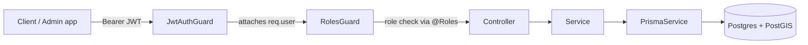
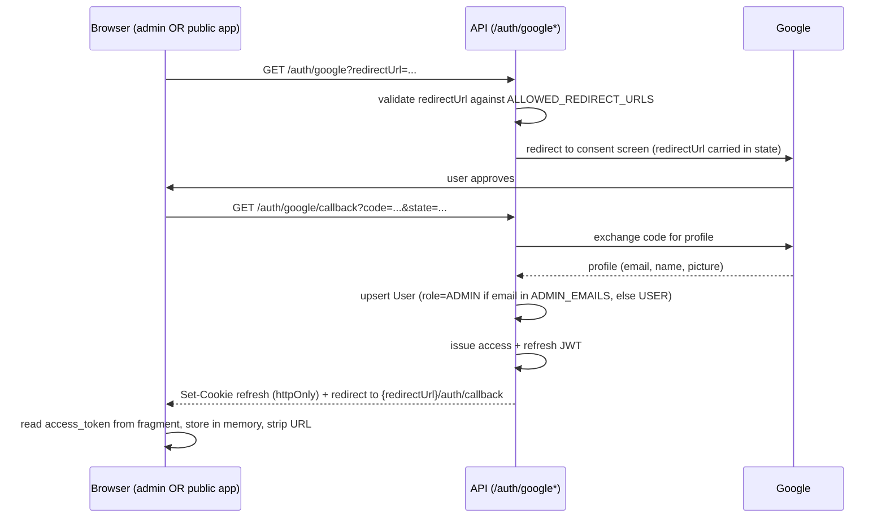

# Architecture — Phase 1–5 (foundation)

Detailed design for [ROADMAP.md](ROADMAP.md) phases 1–5: repo skeleton, auth, RBAC, admin dashboard, master data CRUD. Nothing here touches adventure content — the wiki/article layer is designed in [ADVENTURE_PAGES.md](ADVENTURE_PAGES.md) (Phase 6), the map/geodata layer in [MAP_GEODATA.md](MAP_GEODATA.md) (Phase 7), trip reports in [TRIP_REPORTS.md](TRIP_REPORTS.md) (Phase 8), the guide directory in [GUIDES.md](GUIDES.md) (Phase 9), and trip-companion groups in [TRIP_GROUPS.md](TRIP_GROUPS.md) (Phase 12). The public-facing site (a third app, TanStack Start) is designed in [PUBLIC_PAGES.md](PUBLIC_PAGES.md) (Phase 10), which also resolves §11's "public read access" open decision and requires the auth-flow update in §4 below.

**Status**: built. This doc's Phase 1–5 foundation shipped as designed; §9's admin app has since grown well beyond the master-data-only scope described there — see its status note.

## 1. Repo layout

Single repo, npm workspaces (no Nx/Turborepo — that's tooling overhead a solo project doesn't need yet; revisit only if build times or shared-package count actually become a problem).

```
adventure/
├── apps/
│   ├── api/               # NestJS backend
│   ├── admin/              # React admin frontend (Vite + Refine)
│   └── public/             # TanStack Start — public site, see PUBLIC_PAGES.md
├── packages/
│   └── shared-types/       # DTOs/enums shared between apps (optional, see note)
├── docker-compose.yml       # db + api + admin + public, full container dev
├── Dockerfile.dev            # single dev image shared by all three apps (build context: repo root)
├── .dockerignore
├── package.json             # workspace root
└── .env.example
```

`shared-types` note: only worth creating once the same shape (e.g. a `Role` enum, a master-data DTO shape) is hand-duplicated in both apps and drifting is a real risk. Skip it in Phase 1; add it the first time a duplication actually bites.

## 2. Local infrastructure — full container dev

Everything runs in containers, including the API and admin dev servers — nothing needs installing on the host except Docker. Code is bind-mounted so edits on the host hot-reload inside the containers.

`docker-compose.yml`:

```yaml
services:
  db:
    image: postgis/postgis:16-3.4
    environment:
      POSTGRES_USER: adventure
      POSTGRES_PASSWORD: adventure
      POSTGRES_DB: adventure
    ports:
      - "5432:5432"
    volumes:
      - db_data:/var/lib/postgresql/data
    healthcheck:
      test: ["CMD-SHELL", "pg_isready -U adventure"]
      interval: 5s
      timeout: 5s
      retries: 5

  api:
    build:
      context: .
      dockerfile: Dockerfile.dev
    working_dir: /app
    command: sh -c "npx prisma migrate deploy && npm run start:dev --workspace=apps/api"
    volumes:
      - .:/app
      - /app/node_modules
      - /app/apps/api/node_modules
    env_file: .env
    ports:
      - "3000:3000"
    depends_on:
      db:
        condition: service_healthy

  admin:
    build:
      context: .
      dockerfile: Dockerfile.dev
    working_dir: /app
    command: npm run dev --workspace=apps/admin -- --host 0.0.0.0
    volumes:
      - .:/app
      - /app/node_modules
      - /app/apps/admin/node_modules
    ports:
      - "5173:5173"
    depends_on:
      - api

volumes:
  db_data:
```

Notes:
- PostGIS is enabled at the image level now so the extension exists in the database from day one — no migration surprise when the map phase adds geometry columns later. No table uses spatial types yet.
- The **anonymous volumes** over `node_modules` (root and per-app) are deliberate: without them, the bind-mounted repo root would overwrite the container's Linux-native `node_modules` with whatever's installed on the host, breaking any native dependency. This is the standard Docker Compose pattern for Node dev containers.
- **`DATABASE_URL`'s host is `db`**, not `localhost` — `api` reaches Postgres over the compose network by service name. This is the one env value that differs from a host-run setup.
- Both `api` and `admin` build from the same root `Dockerfile.dev` (see §1) — only the `command:` differs per service, so there's one image definition to maintain instead of two near-duplicates. `public` (PUBLIC_PAGES.md, Phase 10) joins as a fourth service the same way — same `Dockerfile.dev`, its own port and `command:`.
- Root `package.json` needs `"workspaces": ["apps/*", "packages/*"]` for the `--workspace=` flags and node_modules linking to resolve correctly.
- The `api` command runs `prisma migrate deploy` before starting the dev server, so `docker compose up` alone leaves the DB fully migrated — no separate manual migration step. See [DATABASE.md](DATABASE.md) for the schema and migration details.

## 3. API — NestJS module map

```
apps/api/src/
├── main.ts                  # bootstrap, global pipes/filters
├── app.module.ts             # root module, wires everything below
├── config/
│   └── config.module.ts      # @nestjs/config + validation schema (zod or Joi)
├── prisma/
│   ├── prisma.module.ts      # global module, exports PrismaService
│   ├── prisma.service.ts     # PrismaClient wrapper, handles connect/disconnect lifecycle
│   └── schema.prisma
├── auth/
│   ├── auth.module.ts
│   ├── auth.controller.ts    # GET /auth/google, GET /auth/google/callback, POST /auth/refresh, POST /auth/logout
│   ├── auth.service.ts       # Google profile → User upsert, token issuing/verifying
│   ├── strategies/
│   │   ├── google.strategy.ts # passport-google-oauth20, used at /auth/google*
│   │   └── jwt.strategy.ts   # bearer token, used by JwtAuthGuard
│   ├── guards/
│   │   ├── jwt-auth.guard.ts
│   │   └── roles.guard.ts
│   └── decorators/
│       ├── public.decorator.ts   # @Public() — opts a route out of the global JwtAuthGuard
│       ├── roles.decorator.ts    # @Roles('ADMIN')
│       └── current-user.decorator.ts
├── users/
│   ├── users.module.ts
│   ├── users.service.ts       # auth-relevant fields only: id, email, googleId, role, isActive
│   └── dto/
├── profiles/
│   ├── profiles.module.ts
│   ├── profiles.service.ts   # everything else: name, avatarUrl, and future profile fields
│   └── dto/
├── common/
│   ├── filters/http-exception.filter.ts   # standard error response shape
│   ├── interceptors/logging.interceptor.ts
│   └── crud/
│       ├── base-crud.service.ts   # generic service over any Prisma delegate
│       └── base-crud.controller.ts # generic controller factory (list/get/create/update/delete)
├── master-data/
│   ├── activity-type/
│   ├── difficulty-level/
│   ├── season/                # each is a thin module: module + dto, reuses common/crud
│   └── location/               # hierarchical, not flat — see DATABASE.md
│       ├── country/
│       ├── province/
│       ├── district/
│       └── municipality/       # each still reuses common/crud, but its own DTO (parent id required)
└── health/
    └── health.controller.ts   # GET /health
```

### Request flow



`JwtAuthGuard` is registered globally via `APP_GUARD` — every route requires a valid token unless marked `@Public()`. This is the safer default (opt out of auth, rather than opt in) for a project that's about to grow a lot of routes.

## 4. Auth design

Sign-in is **Google only** — no local email/password. No `passwordHash`, no signup form, no argon2; one less auth surface to maintain for a solo project where you're currently the only real user.

- **Identity provider**: Google OAuth 2.0 via `passport-google-oauth20`. Google handles the actual credential check; the API only ever sees a verified email/name/profile picture, never a password.
- **Tokens**: same design as before the OAuth switch — access token (JWT, 15 min TTL) + refresh token (opaque random string, 7 day TTL, stored hashed in a `RefreshToken` table so it can be revoked). Google only participates in the *initial* handshake; afterward, auth on every request is still your own JWT, not a Google token. This means adding a second provider later (or reintroducing email/password) wouldn't touch the RBAC/guard layer at all.
- **Login flow**:
  1. Browser hits `GET /auth/google?redirectUrl=...` → `redirectUrl` must exactly match an entry in the `ALLOWED_REDIRECT_URLS` env var (comma-separated allowlist — both the admin and public app URLs, per PUBLIC_PAGES.md) or the request is rejected. This exists because there are now **two frontends** (`apps/admin`, `apps/public`) that can trigger login, not one — an unvalidated `redirectUrl` would be an open-redirect vulnerability (a crafted login link could hand a stolen access token to an attacker-controlled URL). The validated value is carried through Google's OAuth `state` parameter (standard practice for round-tripping app-specific data through a third-party redirect), then `AuthGuard('google')` redirects to Google's consent screen.
  2. Google redirects back to `GET /auth/google/callback?code=...&state=...` → Passport exchanges the code for a profile (email, name, picture); `state` is decoded back into the original `redirectUrl`.
  3. `AuthService` upserts a `User` row by email (see §5 for role assignment on creation) and a corresponding `Profile` row (`name`, `avatarUrl` from the Google profile — see §6). `User` carries only what auth needs; everything else lives on `Profile`.
  4. API issues an access + refresh token pair — the JWT payload carries only `User` fields (`sub`, `email`, `role`), never `Profile` data, since that's all the guards in §5 ever need to check — sets the refresh token as an **httpOnly cookie**, and 302-redirects the browser to `${redirectUrl}/auth/callback#access_token=...` (the frontend that initiated login, not a single hardcoded app).
  5. Whichever frontend receives the redirect reads `access_token` from the URL fragment (never sent to any server, unlike a query string), stores it in memory, and strips it from the URL/history.
- **Refresh flow**: `POST /auth/refresh` reads the refresh token from the httpOnly cookie (not a request body — the browser sends it automatically), validates against the stored hash, issues a new pair, rotates the stored refresh token (old one invalidated). Requires the API's CORS config to allow credentials from every origin in `ALLOWED_REDIRECT_URLS`, not just one.
- **Logout**: `POST /auth/logout` clears the refresh cookie and deletes the stored `RefreshToken` row. Access tokens aren't individually revocable (stateless JWT tradeoff) — acceptable at 15 min TTL for a solo/local project; revisit if that ever matters.
- **No email verification, no password reset** — neither applies once sign-in is Google-only; Google already owns email verification.



## 5. RBAC design

- `Role` enum in Prisma schema: `ADMIN`, `USER`. Just these two — the richer unverified/verified/moderator contributor tiers from IDEA.md belong to whichever later phase introduces editable content, not here.
- `@Roles('ADMIN')` decorator + `RolesGuard` reads `req.user.role` (populated by `JwtAuthGuard`/`jwt.strategy.ts`) and compares against the decorator's metadata.
- **Admin bootstrap via email allowlist**: `ADMIN_EMAILS` env var (comma-separated). When `AuthService` upserts a `User` on first Google login, if the email matches the allowlist, the row is created with `role: ADMIN`; otherwise `role: USER`. This check only fires on the *create* branch of the upsert, never on update — so removing an email from the allowlist later doesn't silently demote an existing admin on their next login, and a role manually changed in the DB (e.g. promoting someone after the fact) doesn't get reset either. There's no other path to `ADMIN` in this phase — no self-service upgrade, no admin-created-by-admin endpoint yet.

## 6. Database schema (Phase 1–5 tables only)

Full schema, ER diagram, and per-table notes now live in [DATABASE.md](DATABASE.md) — this section just summarizes: `User` (auth-only) + `Profile` (1:1, everything else) + `RefreshToken` for auth; flat master-data tables `DifficultyLevel`/`Season` plus `ActivityType` (flat in spirit, but self-referencing via `parentId` to support nesting, e.g. "Trekking" → "Teahouse Trekking"); and a `Country` → `Province` → `District` → `Municipality` location hierarchy (replacing what was originally planned as a flat `Region` table — see DATABASE.md for why).

`DifficultyLevel` and `Season` share an identical shape on purpose — that's what lets them go through one generic CRUD service/controller instead of separately hand-written ones (see below). `ActivityType` no longer matches them exactly (it carries `parentId`/`children` on top of the same base fields), but still reuses the same generic CRUD factory — see DATABASE.md's per-table notes for the nesting design (cycle prevention, global uniqueness, `onDelete: Restrict`). Adding a new flat type later (e.g. `Tag`) means adding a Prisma model + a ~10-line module, not new CRUD logic. The location hierarchy also reuses the same generic CRUD factory per-level, but each level has its own shape (a parent id), so it doesn't collapse into one shared type the way `DifficultyLevel`/`Season` do.

## 7. Generic CRUD pattern

`common/crud/base-crud.service.ts` — a class parameterized over a Prisma delegate (e.g. `prisma.activityType`), providing `list(pagination, includeInactive?)`, `get(id)`, `create(dto)`, `update(id, dto)`, `delete(id)`. All master-data tables have `isActive` (see [DATABASE.md](DATABASE.md)), so `delete(id)` is a soft delete (`isActive = false`), not a SQL `DELETE` — later content phases will foreign-key into these tables, and a hard delete would either violate that FK or orphan content. `list()` filters `isActive = true` by default; `?includeInactive=true` (admin-only) surfaces soft-deleted rows so they can be restored via the existing `update(id, { isActive: true })` — no separate restore endpoint needed.

`common/crud/base-crud.controller.ts` — a factory function `createCrudController({ path, service, createDto, updateDto })` returning a Nest controller class with the five REST routes wired up, `@Roles('ADMIN')` applied to write routes (list/get can be `@Public()` or open to any authenticated role — decide per table if any master data should be publicly readable before admin-dashboard read UI is needed).

Each `master-data/<type>/` module is then just:
```ts
// activity-type.module.ts
const ActivityTypeController = createCrudController({
  path: 'activity-types',
  delegate: (prisma) => prisma.activityType,
  createDto: CreateActivityTypeDto,
  updateDto: UpdateActivityTypeDto,
});
```
DTOs still get hand-written per type (that's where field-specific validation lives), but the controller/service boilerplate isn't repeated.

### API conventions

- Prefix: `/api/v1/...`
- List endpoints: `GET /api/v1/activity-types?page=1&pageSize=20` → `{ data: [...], total, page, pageSize }`
- No response envelope on single-resource endpoints — return the resource directly; errors go through the global exception filter, not a wrapped success/error field. Keeps the common case simple.
- Validation: `class-validator` + `class-transformer`, global `ValidationPipe({ whitelist: true, forbidNonWhitelisted: true })` — unknown fields in a request body are rejected, not silently dropped or accepted.

## 8. Admin bootstrap

No seed script — there's no way to pre-create a Google-authenticated user without a real Google login, so there's nothing to seed. Instead, becoming an admin is just: log in with Google once, using an email listed in `ADMIN_EMAILS` (see §5). The upsert-on-first-login logic in `AuthService` is the entire bootstrap mechanism.

## 9. Admin app (`apps/admin`)

**Status**: grew past this section's original master-data-only scope. Beyond the four resources below, admin now also manages Users (role/active, with a guard against an admin demoting/deactivating themselves), Adventure Pages (verification-status moderation — a `PATCH .../verification-status` admin-only endpoint that didn't exist before), Trip Reports and Trip Groups (view/delete), Trails/Spots (verification-status moderation, TRIP_GROUPS.md/MAP_GEODATA.md), and Guide Profiles (the license verification review queue GUIDES.md called for). All at **read + moderate** depth — creating/editing the underlying content stays in the public contribute flow, so the compound-write logic (revisions, confirmations, transactions) isn't duplicated. The sidebar is grouped (Master Data / Locations / Content / Trails & Spots) rather than one flat resource list. The Refine + Ant Design choice below is unchanged; only reskinned with the same palette as `apps/public` via Ant Design's `ConfigProvider` theme tokens.

- React + Vite + Refine (data provider pointed at the Nest REST API), UI kit: Ant Design (Refine's default, least setup).
- Auth provider: "Sign in with Google" button navigates the browser (full page nav, not fetch/XHR — OAuth redirects can't be done via AJAX) to `${API_URL}/auth/google`. After the Google → API → admin-app redirect chain (see §4), the admin app reads the access token from the URL fragment, stores it in memory only (not localStorage, to reduce XSS token-theft surface), and strips it from the URL. The refresh token never touches JS — it lives in an httpOnly cookie the browser sends automatically to `/auth/refresh`.
- Resources: one Refine resource per master-data type, each auto-generating list/create/edit/delete screens from the CRUD endpoints — this is most of Phase 5's admin UI for free, not hand-built screens.
- Phase 4 ships just the shell: login screen + empty authenticated layout, no resources registered yet. Phase 5 adds the four resources.
- The Vite dev server runs inside the `admin` container (see §2) and must bind `--host 0.0.0.0`, not just `localhost` — otherwise it's only reachable from inside the container's own network namespace, not from the host browser at `localhost:5173`.

## 10. Config & environment

`.env` (gitignored) / `.env.example` (committed):

```
DATABASE_URL=postgresql://adventure:adventure@db:5432/adventure
JWT_ACCESS_SECRET=
JWT_ACCESS_TTL=15m
JWT_REFRESH_SECRET=
JWT_REFRESH_TTL=7d
GOOGLE_CLIENT_ID=
GOOGLE_CLIENT_SECRET=
GOOGLE_CALLBACK_URL=http://localhost:3000/api/v1/auth/google/callback
ADMIN_EMAILS=
ALLOWED_REDIRECT_URLS=http://localhost:5173,http://localhost:3001
PORT=3000
```

`GOOGLE_CLIENT_ID`/`GOOGLE_CLIENT_SECRET` come from a Google Cloud OAuth consent screen + credentials setup (external, one-time, done in Google Cloud Console — not something this doc can script). `GOOGLE_CALLBACK_URL` must exactly match what's registered there. `ALLOWED_REDIRECT_URLS` replaces the old single `ADMIN_APP_URL` — a comma-separated allowlist of every frontend allowed to receive a post-login redirect (admin at `:5173`, `apps/public` at whatever port it runs on — see PUBLIC_PAGES.md), validated per §4 rather than trusted as a single fixed value. `ADMIN_EMAILS` is the comma-separated allowlist from §5.

`DATABASE_URL`'s host is `db` — the compose service name — not `localhost`, since the api now runs inside the same compose network as Postgres (see §2). This `.env` is consumed by the `api` service via `env_file:` in `docker-compose.yml`; there's no host-run mode left that would read it directly.

Validated at boot via a Zod schema in `config/config.module.ts` — the app should fail to start with a clear error if a required var is missing, not fail confusingly at first use.

## 11. Open decisions — resolved by implementation

All three items originally listed here are resolved now that the repo is built: **repo split** landed as a single repo (as above); **UI kit for admin** landed as Ant Design, now themed via `ConfigProvider` per §9's status note rather than reconsidered; **Google Cloud project setup** was completed out-of-band (real `GOOGLE_CLIENT_ID`/`GOOGLE_CLIENT_SECRET` in `.env`, gitignored).

Also resolved: refresh token transport is an **httpOnly cookie** (§4) — the OAuth redirect flow forces this shape rather than allowing tokens in a plain JSON response body. **Public read access** is resolved too — content and master-data GETs are `@Public()`, per PUBLIC_PAGES.md (Phase 10), which needs anonymous visitors to read them.
