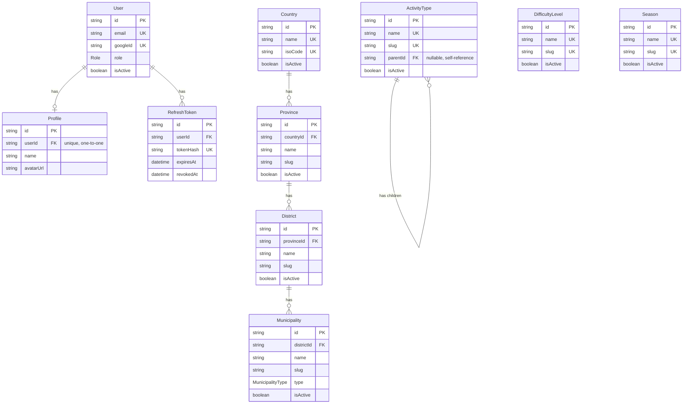

# Database design — Phase 1–5 (foundation)

Full schema for [ARCHITECTURE.md](ARCHITECTURE.md)'s foundation phases: auth, RBAC, master data. No adventure-content tables (map/wiki/trips) yet — those get designed when that phase starts, and will foreign-key into the master-data tables below.

Nothing here is migrated yet — this is the schema.prisma content to implement in Phase 1.

## Conventions

- **IDs**: `String @id @default(uuid())` everywhere — Prisma-generated UUIDv4, no dependency on a Postgres extension (`gen_random_uuid()` would need `pgcrypto`). Simple, portable, no DB-side config needed.
- **Timestamps**: `createdAt DateTime @default(now())` + `updatedAt DateTime @updatedAt` on every table — Prisma manages `updatedAt` automatically on writes.
- **Table naming**: Prisma models stay PascalCase/camelCase (idiomatic Prisma/TS); actual Postgres table names are mapped to `snake_case` plural via `@@map` (idiomatic Postgres/SQL, matters if you ever query the DB directly or use another tool against it). Columns are **not** individually `@map`'d — they stay camelCase in Postgres too, matching the Prisma field 1:1. This is a middle ground: minimal mapping boilerplate, but table names still read naturally in `psql`.
- **Soft delete**: every table that the generic CRUD "delete" route can touch has `isActive Boolean @default(true)`. Deleting a row means setting `isActive = false`, never removing it. Reasoning: master-data tables (`ActivityType`, `DifficultyLevel`, `Season`, and the location hierarchy) will be foreign-keyed into by adventure-content tables in a later phase — a hard delete would either fail on the FK constraint or silently orphan content. Soft delete also means "undo" is just flipping the flag back via the existing generic `update()` endpoint — no separate restore endpoint needed.
- **Enums**: Prisma native `enum`, not a string column with app-level validation — Postgres enforces it at the DB level too.
- **Hierarchical FKs use `onDelete: Restrict`, not `Cascade`**: the location hierarchy (`Country` → `Province` → `District` → `Municipality`) uses `Restrict` on each parent relation, unlike `Profile`/`RefreshToken`'s `Cascade` off `User`. A cascade here would mean deleting one `Country` row silently wipes every province, district, and municipality beneath it — far more dangerous than the one-hop cascades elsewhere. `Restrict` forces an explicit decision (reassign or soft-delete children first) before a parent can go. In practice this rarely matters since deletes are soft anyway, but it's the correct safety net for the rare hard delete.

## Schema (`prisma/schema.prisma`)

```prisma
datasource db {
  provider = "postgresql"
  url      = env("DATABASE_URL")
}

generator client {
  provider = "prisma-client-js"
}

enum Role {
  ADMIN
  USER
}

model User {
  id        String   @id @default(uuid())
  email     String   @unique
  googleId  String   @unique
  role      Role     @default(USER)
  isActive  Boolean  @default(true)
  createdAt DateTime @default(now())
  updatedAt DateTime @updatedAt

  profile       Profile?
  refreshTokens RefreshToken[]

  @@map("users")
}

model Profile {
  id        String   @id @default(uuid())
  userId    String   @unique
  user      User     @relation(fields: [userId], references: [id], onDelete: Cascade)
  name      String?
  avatarUrl String?
  createdAt DateTime @default(now())
  updatedAt DateTime @updatedAt

  @@map("profiles")
}

model RefreshToken {
  id        String    @id @default(uuid())
  userId    String
  user      User      @relation(fields: [userId], references: [id], onDelete: Cascade)
  tokenHash String    @unique
  expiresAt DateTime
  revokedAt DateTime?
  createdAt DateTime  @default(now())

  @@index([userId])
  @@map("refresh_tokens")
}

model ActivityType {
  id          String   @id @default(uuid())
  name        String   @unique
  slug        String   @unique
  description String?
  sortOrder   Int      @default(0)
  isActive    Boolean  @default(true)
  createdAt   DateTime @default(now())
  updatedAt   DateTime @updatedAt

  parentId String?
  parent   ActivityType?  @relation("ActivityTypeHierarchy", fields: [parentId], references: [id], onDelete: Restrict)
  children ActivityType[] @relation("ActivityTypeHierarchy")

  @@map("activity_types")
}

enum MunicipalityType {
  METROPOLITAN_CITY
  SUB_METROPOLITAN_CITY
  MUNICIPALITY
  RURAL_MUNICIPALITY
}

model Country {
  id        String   @id @default(uuid())
  name      String   @unique
  isoCode   String   @unique // ISO 3166-1 alpha-2, e.g. "NP"
  isActive  Boolean  @default(true)
  createdAt DateTime @default(now())
  updatedAt DateTime @updatedAt

  provinces Province[]

  @@map("countries")
}

model Province {
  id        String   @id @default(uuid())
  countryId String
  country   Country  @relation(fields: [countryId], references: [id], onDelete: Restrict)
  name      String
  slug      String
  isActive  Boolean  @default(true)
  createdAt DateTime @default(now())
  updatedAt DateTime @updatedAt

  districts District[]

  @@unique([countryId, slug])
  @@map("provinces")
}

model District {
  id         String   @id @default(uuid())
  provinceId String
  province   Province @relation(fields: [provinceId], references: [id], onDelete: Restrict)
  name       String
  slug       String
  isActive   Boolean  @default(true)
  createdAt  DateTime @default(now())
  updatedAt  DateTime @updatedAt

  municipalities Municipality[]

  @@unique([provinceId, slug])
  @@map("districts")
}

model Municipality {
  id         String           @id @default(uuid())
  districtId String
  district   District         @relation(fields: [districtId], references: [id], onDelete: Restrict)
  name       String
  slug       String
  type       MunicipalityType
  isActive   Boolean          @default(true)
  createdAt  DateTime         @default(now())
  updatedAt  DateTime         @updatedAt

  @@unique([districtId, slug])
  @@map("municipalities")
}

model DifficultyLevel {
  id          String   @id @default(uuid())
  name        String   @unique
  slug        String   @unique
  description String?
  sortOrder   Int      @default(0)
  isActive    Boolean  @default(true)
  createdAt   DateTime @default(now())
  updatedAt   DateTime @updatedAt

  @@map("difficulty_levels")
}

model Season {
  id          String   @id @default(uuid())
  name        String   @unique
  slug        String   @unique
  description String?
  sortOrder   Int      @default(0)
  isActive    Boolean  @default(true)
  createdAt   DateTime @default(now())
  updatedAt   DateTime @updatedAt

  @@map("seasons")
}
```

## Entity relationships



`ActivityType`/`DifficultyLevel`/`Season` have no relations to `User` or content tables yet — they'll gain inbound relations once an adventure-content table exists to reference them (later phase). `ActivityType` does have one relation already, though: a self-reference to support nesting (e.g. "Trekking" as parent of "Teahouse Trekking"). `Country`/`Province`/`District`/`Municipality` form their own internal hierarchy, same as `ActivityType`'s self-reference but across four separate tables instead of one — likewise no inbound relations from content tables yet.

## Per-table notes

- **`User`**: `onDelete` isn't relevant on `User` itself since nothing points *to* it via a delete-cascade chain except its own children (`Profile`, `RefreshToken`) — see below. Deactivating a user is `isActive = false`; there's no admin-facing CRUD screen for `User` in Phase 1–5 (only master data gets admin screens per the roadmap), so this happens via direct DB access for now, not an endpoint.
- **`Profile`**: `onDelete: Cascade` on the `userId` relation — if a `User` row were ever hard-deleted (shouldn't normally happen per the soft-delete convention, but e.g. a manual admin cleanup), its `Profile` goes with it rather than becoming an orphaned row.
- **`RefreshToken`**: same `onDelete: Cascade` reasoning. `tokenHash` is `@unique` (not just indexed) — the refresh flow looks up a row by hashing the incoming cookie value and querying on this column, so it needs to be both fast (index, which `@unique` provides for free) and unique (two valid live tokens should never hash-collide in practice, and uniqueness lets lookup use `findUniqueOrThrow` instead of `findFirst`).
- **Flat master-data tables** (`ActivityType`, `DifficultyLevel`, `Season`): `slug` is separate from `name` because `name` is the human-editable display label while `slug` is the stable, URL-safe identifier later content phases will reference — changing a display name shouldn't change its slug/identity. `DifficultyLevel` and `Season` are identical in shape (see [ARCHITECTURE.md](ARCHITECTURE.md) §6/§7 on the generic CRUD pattern this enables); `ActivityType` no longer matches them exactly since it also carries `parentId`/`children` — see below.
- **`ActivityType` nesting**: `parentId` is a nullable self-relation (e.g. "Trekking" → "Teahouse Trekking" / "Camping Trekking"), depth is unbounded — there's no schema-level limit on how deep the tree goes. `onDelete: Restrict` on the self-relation, same reasoning as the location hierarchy: cascading could silently wipe an entire subtree from one delete, and deletes are soft (`isActive`) anyway so `Restrict` is a safety net for the rare hard delete, not the primary defense. `name`/`slug` stay **globally** unique regardless of nesting — not scoped per-parent — which also sidesteps a real Postgres gotcha: a composite `@@unique([parentId, slug])` wouldn't actually enforce uniqueness among top-level rows, since Postgres never considers two `NULL`s equal in a unique index. **Cycle prevention** can't be expressed as a DB constraint on a self-referencing FK — the service layer must reject any update that would set a row's `parentId` to one of its own descendants (walk from the proposed parent up to the root; reject if the row's own `id` appears in that chain). `ActivityType` still reuses the same generic `base-crud` factory from ARCHITECTURE.md §7 as the flat tables and the location hierarchy — the factory only needs a Prisma delegate + DTOs, not a shared shape. `list()` keeps returning a flat array (`{ data, total, page, pageSize }`, unchanged); rendering it as a tree is an admin-dashboard UI concern, not a change to the CRUD contract.
- **Location hierarchy** (`Country` → `Province` → `District` → `Municipality`): replaces what used to be a standalone `Region` master-data table (e.g. "Everest Region") with real administrative geography. Each level's `slug` is unique **within its parent**, not globally (`@@unique([countryId, slug])` etc.) — e.g. two different provinces could plausibly each have a district with the same slug, and that's fine; identity is the (parent, slug) pair, not the slug alone. `Country` carries `isoCode` (ISO 3166-1 alpha-2) so it's real reference data, not a Nepal-only stub, even though only Nepal gets populated for now (see Migrations below). `Municipality.type` is a native enum (`METROPOLITAN_CITY` / `SUB_METROPOLITAN_CITY` / `MUNICIPALITY` / `RURAL_MUNICIPALITY`) reflecting Nepal's actual local-government classification — worth keeping even though the platform is Nepal-only right now, since it's real domain data, not speculative generality.
- Unlike the flat master-data tables, each location level needs its **own** DTO (a `Province` create/update DTO requires `countryId`, `District` requires `provinceId`, etc.) — they still each reuse the same generic `base-crud.controller.ts`/`base-crud.service.ts` factory from ARCHITECTURE.md §7 (the factory only cares about a Prisma delegate + DTOs, not a shared shape), but the admin dashboard's create/edit forms need cascading selects (pick a country → its provinces populate → pick a province → its districts populate) — a UI-layer concern beyond the generic CRUD pattern itself, worth calling out now so Phase 5's admin screens don't assume flat independent dropdowns for these four.

## Generic CRUD + soft delete, concretely

Updates the behavior described in ARCHITECTURE.md §7:
- `list()` filters `WHERE isActive = true` by default; an admin can pass `?includeInactive=true` to see soft-deleted rows too (needed to find something to restore).
- `delete(id)` is `UPDATE ... SET isActive = false`, not a SQL `DELETE`.
- Restoring a soft-deleted row reuses the existing generic `update(id, { isActive: true })` — no separate restore endpoint needed.

## Migrations

- `npx prisma migrate dev --name init` generates the first migration from the schema above, run locally against the `db` container during Phase 1 development.
- In the `api` container (see ARCHITECTURE.md §2), migrations should run automatically on startup so `docker compose up` alone is enough to get a fully-migrated DB — no separate manual migration step for a solo dev to remember. Compose `command:` becomes:
  ```
  sh -c "npx prisma migrate deploy && npm run start:dev --workspace=apps/api"
  ```
- **Revised: seed scripts now exist**, superseding the original "no seed script" default below (kept for history). They live in `apps/api/prisma/scripts/` and are run manually (`npm run seed:locations|seed:master-data|seed:dev-data|seed:all --workspace=apps/api`) — never wired into `prisma migrate deploy` or container startup, so they stay opt-in the way a "one-off" script should:
  - `import-locations.ts` — the location-hierarchy exception described below, reading `prisma/seed-data/nepal-locations.json`.
  - `seed-master-data.ts` — activity types (with a small parent/child hierarchy), difficulty levels, seasons, spot types, tags, languages. Originally deferred to the admin dashboard per Phase 5; reintroduced so a fresh dev DB isn't empty. Idempotent (upserts by unique slug/isoCode).
  - `seed-dev-data.ts` — fake demo content (users with placeholder `googleId`s, two adventure pages with revisions/trails/spots, trip reports with kudos/comments, a trip group, two guide profiles) for local development only. Idempotent by construction (upserts or existence checks keyed on natural fields like title), safe to re-run.
- ~~No seed script (per ARCHITECTURE.md §8) — master-data rows (activity types, difficulty levels, ...) get created through the admin dashboard once Phase 5 ships, not via a migration-time seed.~~ Superseded above.
- **Location hierarchy's real data**: Nepal's actual administrative geography is 1 country, 7 provinces, 77 districts, and roughly 753 municipalities — entering that one row at a time through the admin CRUD screens isn't reasonable, and it's static public reference data (not user-curated content), unlike activity types or difficulty levels which really are a handful of hand-picked rows. Implemented as the **one-off data-import script** anticipated here: `prisma/seed-data/nepal-locations.json` (province/district/municipality names + hierarchy, sourced from the `nepal-places` npm package, not an official government dataset — see the open decision below) loaded by `import-locations.ts`. Districts covering IDEA.md's named restricted regions (Manang, Mustang, Gorkha) are flagged `requiresRegisteredAgency: true`; no other districts are.

## Open decisions for you to confirm

1. **Table/column naming**: confirmed above as `@@map` on tables (snake_case plural) with camelCase columns left unmapped — flag if you'd rather map columns to snake_case too for full SQL-side consistency.
2. **`includeInactive` access**: should *any* authenticated user be able to pass `?includeInactive=true` on master-data list endpoints, or admin-only? Given master-data write routes are already admin-only (ARCHITECTURE.md §7), admin-only for this too is the consistent default unless you want it open.
3. **Nepal geography data source isn't an official one.** `nepal-locations.json` was generated from the third-party `nepal-places` npm package (province/district/municipality names and counts — 7/77/753 — match the commonly-cited figures), not fetched directly from the Ministry of Federal Affairs and General Administration or National Statistics Office. Fine for development/demo purposes; if this data ends up user-facing in a context where authoritativeness matters, re-derive `nepal-locations.json` from an official source before relying on it.
4. **`requiresRegisteredAgency` district list is a simplification.** Only Manang, Mustang, and Gorkha are flagged, chosen as reasonable proxies for IDEA.md's three named regions (Annapurna's restricted Nar-Phu area, Upper Mustang, Manaslu). Real restricted-area permit rules are more nuanced (e.g. Upper Dolpo, Kanchenjunga, Tsum Valley, Humla's Limi valley are also restricted) — revisit against the actual Nepal Tourism Board restricted-area list before this flag is used to gate anything in production.
