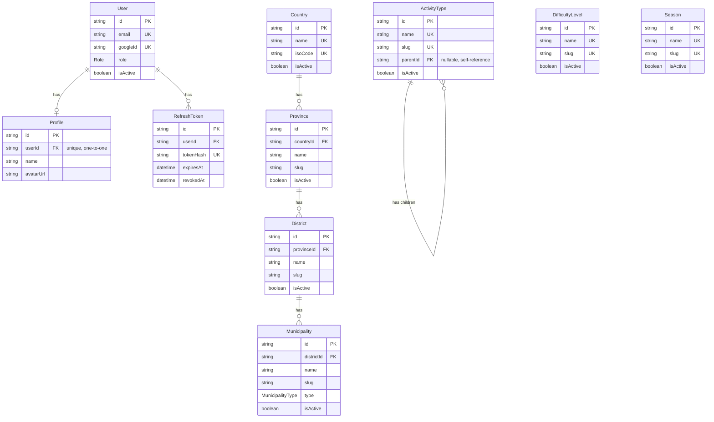
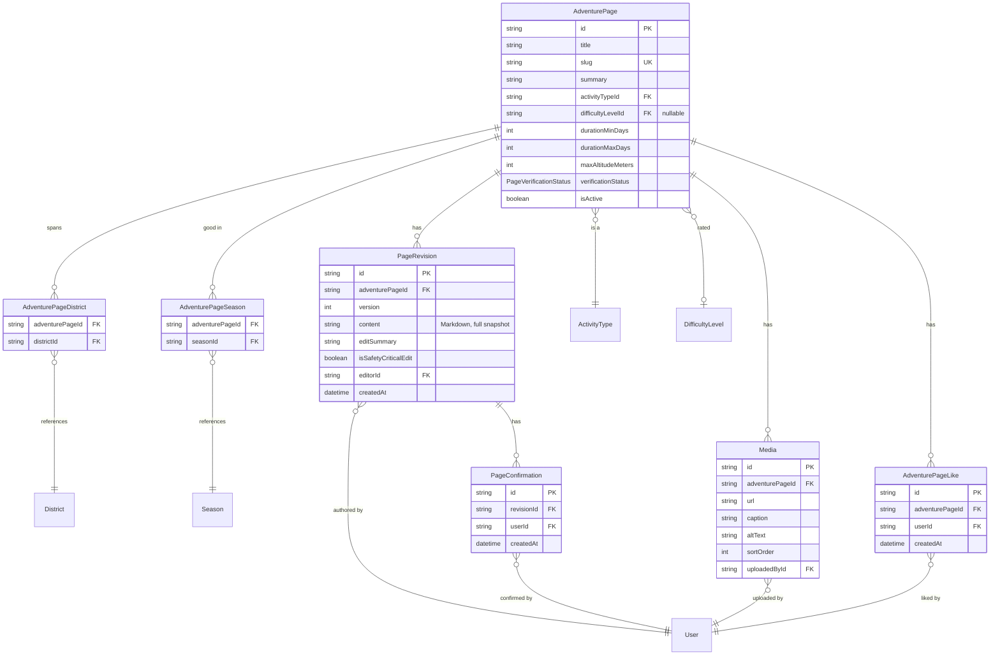
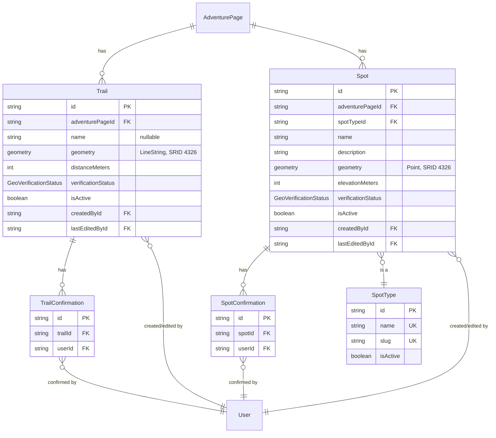
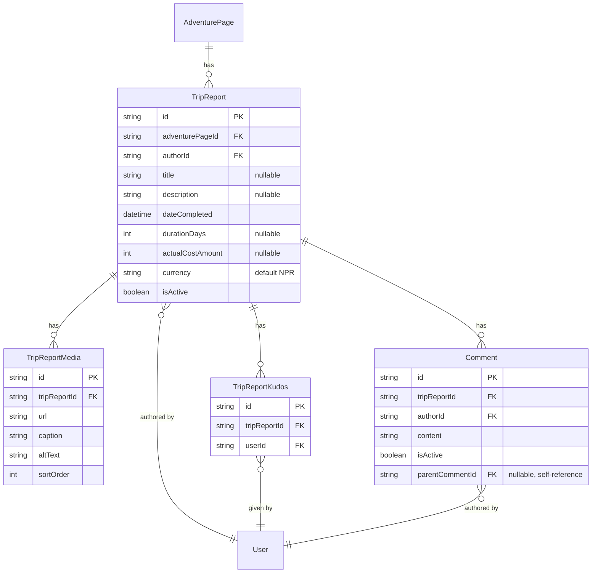
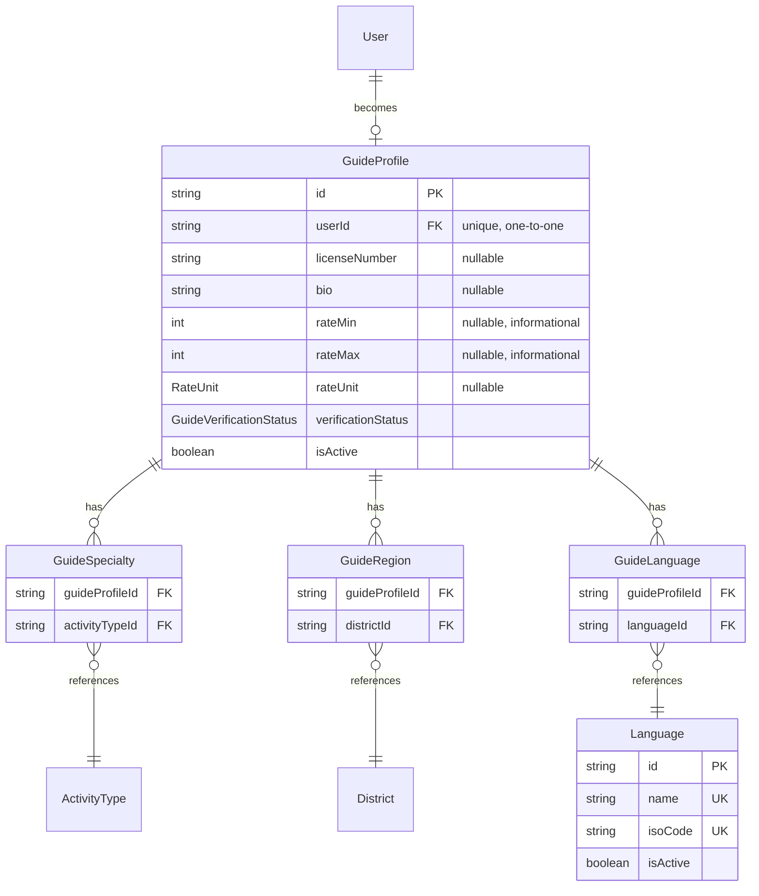
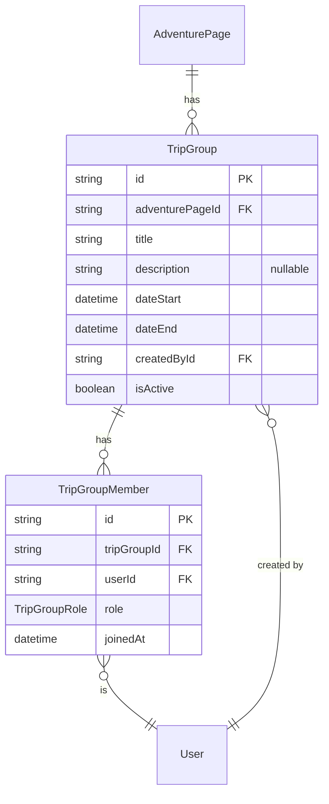

# Feature design — merged reference

Merged from the 10 per-phase design docs that previously lived at the repo root (ADVENTURE_PAGES.md, DATABASE.md, DEPLOYMENT.md, GUIDES.md, MAP_GEODATA.md, PUBLIC_PAGES.md, ROADMAP.md, SEARCH_AND_NOTIFICATIONS.md, TRIP_GROUPS.md, TRIP_REPORTS.md), now that all of Phases 1–14 are built (see CLAUDE.md). Sections below are ordered to match build order; each keeps its schema, entity-relationship diagram, and non-obvious service-layer rationale, but drops the "not built yet" scaffolding (status lines, per-doc dependency preambles, "required additions to existing models" tables) that only mattered while each phase was still pending — those additions are all long since applied to the live `apps/api/prisma/schema.prisma`, which remains the actual source of truth for the schema.

For product vision and the trust model, see [IDEA.md](IDEA.md). For the Phase 1–5 architecture (repo layout, NestJS module map, RBAC, generic CRUD, admin app), see [ARCHITECTURE.md](ARCHITECTURE.md). The four items that were fully undesigned as of the last roadmap pass are now designed, not yet built: UI i18n ([I18N.md](I18N.md)), trail elevation profiles + GPX import ([TRAIL_ELEVATION.md](TRAIL_ELEVATION.md)), spatially-derived district tagging (§4, below), and geodata changeset history ([GEODATA_HISTORY.md](GEODATA_HISTORY.md)). [REMAINING_WORK_PLAN.md](REMAINING_WORK_PLAN.md) is the design-process record for how those four were scoped.

## Contents

1. [Roadmap summary](#1-roadmap-summary)
2. [Database foundation](#2-database-foundation)
3. [Adventure pages — wiki/article layer](#3-adventure-pages--wikiarticle-layer)
4. [Map / geodata layer](#4-map--geodata-layer)
5. [Trip reports — social layer](#5-trip-reports--social-layer)
6. [Guide directory](#6-guide-directory)
7. [Public site](#7-public-site)
8. [Trip-companion groups](#8-trip-companion-groups)
9. [Search & notifications](#9-search--notifications)
10. [Deployment](#10-deployment)
11. [Open decisions](#11-open-decisions)

---

## 1. Roadmap summary

Companion to IDEA.md — solo side project, phases sized to be shippable in evenings/weekends. Stack locked at Phase 1: **NestJS** (backend), **PostgreSQL + PostGIS** (PostGIS enabled from day one so the later map phase needs no extension migration), **Prisma** (ORM; PostGIS geometry columns use `Unsupported("geometry")` + raw SQL since Prisma can't natively type them), **React + Refine + Ant Design** (admin), and later **TanStack Start** (public site, §7). Full container dev via docker-compose — nothing needs installing on the host except Docker.

| Phase | Name | Status |
|---|---|---|
| 1 | Repo & architecture skeleton | done |
| 2 | Authentication (Google OAuth) | done |
| 3 | Authorization (RBAC: `ADMIN`/`USER`) | done |
| 4 | Admin dashboard shell | done |
| 5 | Master data CRUD | done |
| 6 | Adventure pages (wiki/article layer) — §3 | done |
| 7 | Map / geodata layer — §4 | done |
| 8 | Trip reports (social layer) — §5 | done |
| 9 | Guide directory — §6 | done |
| 10 | Public site — §7 | done |
| 10.5 | Public site visual identity (Tailwind, pine-green/terracotta palette, dark mode) | done |
| 10.6 | Admin beyond master data (Users, Adventure Pages, Trip Reports, Guide Profiles moderation) | done |
| 11 | Map/geodata UI (Leaflet rendering, draw-a-trail contribute flow) | done |
| 12 | Trip-companion groups — §8 | done |
| 13 | Content enhancement grab-bag (tags, "see also", threaded replies, multi-currency costs, `rateUnit` enum) | done |
| 14 | Full-text search + notifications — §9 | done |
| — | Hosting/deployment — §10 | done |
| — | UI-language i18n | **designed** (English-only, catalogue-ready) — see I18N.md |
| — | Elevation-along-path profiles + GPX import | **designed** — see TRAIL_ELEVATION.md |
| — | Spatially-derived district tagging | **designed** — see §4, above |
| — | Full OSM-style changeset history for geodata | **designed** — see GEODATA_HISTORY.md |

The one long-deferred product question — which content pillar goes live first — was resolved in Phase 10: **Discover → Contribute → Share → Connect** (reasoning in §7).

---

## 2. Database foundation

Conventions that apply to every table in this document, not just the ones below:

- **IDs**: `String @id @default(uuid())` everywhere — Prisma-generated UUIDv4, no dependency on a Postgres extension.
- **Timestamps**: `createdAt DateTime @default(now())` + `updatedAt DateTime @updatedAt` on every table (revision/log tables that are immutable by design, e.g. `PageRevision`, are the deliberate exception — `createdAt` only).
- **Table naming**: Prisma models stay PascalCase/camelCase; Postgres table names are mapped to snake_case plural via `@@map`. Columns are **not** individually mapped — they stay camelCase in Postgres too.
- **Soft delete**: any table the generic CRUD "delete" route can touch has `isActive Boolean @default(true)`. Delete = `isActive = false`, never a SQL `DELETE`. `list()` filters `WHERE isActive = true` by default; `?includeInactive=true` (admin-only) surfaces soft-deleted rows; restoring reuses the generic `update(id, { isActive: true })`.
- **Enums**: Prisma native `enum`, enforced at the DB level.
- **Hierarchical/lookup FKs use `onDelete: Restrict`**; content owned exclusively by a parent row uses `onDelete: Cascade` (e.g. `Profile`→`User`, `PageRevision`→`AdventurePage`). A cascade on a hierarchy root (e.g. `Country`) would silently wipe everything beneath it — `Restrict` forces an explicit decision first, a safety net for the rare hard delete even though deletes are soft in practice.
- **`Unsupported(...)` columns** (PostGIS geometry, `tsvector`) aren't diff-managed by `prisma migrate dev` — hand-added GiST/GIN indexes must be re-verified after every migration that touches an unrelated table in the same pass, since Prisma has (twice) generated spurious `DROP INDEX` statements for these columns when regenerating migrations for other tables.
- **Prefer duplicated-but-simple tables over a shared/polymorphic one** when Prisma can't express the polymorphism cleanly — e.g. `Media` vs. `TripReportMedia`, or three separate `*Confirmation` tables instead of one generic one.

### Schema (`prisma/schema.prisma`)

```prisma
datasource db {
  provider = "postgresql"
  url      = env("DATABASE_URL")
}

generator client {
  provider = "prisma-client-js"
}

enum Role {
  ADMIN
  USER
}

model User {
  id        String   @id @default(uuid())
  email     String   @unique
  googleId  String   @unique
  role      Role     @default(USER)
  isActive  Boolean  @default(true)
  createdAt DateTime @default(now())
  updatedAt DateTime @updatedAt

  profile       Profile?
  refreshTokens RefreshToken[]

  @@map("users")
}

model Profile {
  id        String   @id @default(uuid())
  userId    String   @unique
  user      User     @relation(fields: [userId], references: [id], onDelete: Cascade)
  name      String?
  avatarUrl String?
  createdAt DateTime @default(now())
  updatedAt DateTime @updatedAt

  @@map("profiles")
}

model RefreshToken {
  id        String    @id @default(uuid())
  userId    String
  user      User      @relation(fields: [userId], references: [id], onDelete: Cascade)
  tokenHash String    @unique
  expiresAt DateTime
  revokedAt DateTime?
  createdAt DateTime  @default(now())

  @@index([userId])
  @@map("refresh_tokens")
}

model ActivityType {
  id          String   @id @default(uuid())
  name        String   @unique
  slug        String   @unique
  description String?
  sortOrder   Int      @default(0)
  isActive    Boolean  @default(true)
  createdAt   DateTime @default(now())
  updatedAt   DateTime @updatedAt

  parentId String?
  parent   ActivityType?  @relation("ActivityTypeHierarchy", fields: [parentId], references: [id], onDelete: Restrict)
  children ActivityType[] @relation("ActivityTypeHierarchy")

  @@map("activity_types")
}

enum MunicipalityType {
  METROPOLITAN_CITY
  SUB_METROPOLITAN_CITY
  MUNICIPALITY
  RURAL_MUNICIPALITY
}

model Country {
  id        String   @id @default(uuid())
  name      String   @unique
  isoCode   String   @unique // ISO 3166-1 alpha-2, e.g. "NP"
  isActive  Boolean  @default(true)
  createdAt DateTime @default(now())
  updatedAt DateTime @updatedAt

  provinces Province[]

  @@map("countries")
}

model Province {
  id        String   @id @default(uuid())
  countryId String
  country   Country  @relation(fields: [countryId], references: [id], onDelete: Restrict)
  name      String
  slug      String
  isActive  Boolean  @default(true)
  createdAt DateTime @default(now())
  updatedAt DateTime @updatedAt

  districts District[]

  @@unique([countryId, slug])
  @@map("provinces")
}

model District {
  id         String   @id @default(uuid())
  provinceId String
  province   Province @relation(fields: [provinceId], references: [id], onDelete: Restrict)
  name       String
  slug       String
  requiresRegisteredAgency Boolean @default(false) // added in GUIDES.md (§6) — restricted-area permit rule
  isActive   Boolean  @default(true)
  createdAt  DateTime @default(now())
  updatedAt  DateTime @updatedAt

  municipalities Municipality[]
  adventurePageDistricts AdventurePageDistrict[]
  guideRegions GuideRegion[]

  @@unique([provinceId, slug])
  @@map("districts")
}

model Municipality {
  id         String           @id @default(uuid())
  districtId String
  district   District         @relation(fields: [districtId], references: [id], onDelete: Restrict)
  name       String
  slug       String
  type       MunicipalityType
  isActive   Boolean          @default(true)
  createdAt  DateTime         @default(now())
  updatedAt  DateTime         @updatedAt

  @@unique([districtId, slug])
  @@map("municipalities")
}

model DifficultyLevel {
  id          String   @id @default(uuid())
  name        String   @unique
  slug        String   @unique
  description String?
  sortOrder   Int      @default(0)
  isActive    Boolean  @default(true)
  createdAt   DateTime @default(now())
  updatedAt   DateTime @updatedAt

  @@map("difficulty_levels")
}

model Season {
  id          String   @id @default(uuid())
  name        String   @unique
  slug        String   @unique
  description String?
  sortOrder   Int      @default(0)
  isActive    Boolean  @default(true)
  createdAt   DateTime @default(now())
  updatedAt   DateTime @updatedAt

  @@map("seasons")
}
```

*(`District.requiresRegisteredAgency` is shown inline above rather than in a separate "required additions" table — it's the one genuinely new column GUIDES.md added to an already-shipped model, not just a reverse-relation array.)*

### Entity relationships



### Per-table notes

- **`RefreshToken.tokenHash`** is `@unique` (not just indexed) — the refresh flow hashes the incoming cookie value and looks up by it, so it needs both speed and uniqueness (`findUniqueOrThrow` instead of `findFirst`).
- **Flat master-data tables** (`ActivityType`, `DifficultyLevel`, `Season`, and later `SpotType`/`Tag`/`Language`): `slug` is separate from `name` — `name` is the human-editable display label, `slug` is the stable identifier later content phases reference.
- **`ActivityType` nesting**: `parentId` self-relation, unbounded depth, `onDelete: Restrict`. `name`/`slug` stay **globally** unique regardless of nesting — a composite `@@unique([parentId, slug])` wouldn't actually enforce uniqueness among top-level rows since Postgres never treats two `NULL`s as equal. **Cycle prevention can't be a DB constraint** on a self-referencing FK — the service layer must reject any update that would set a row's `parentId` to one of its own descendants.
- **Location hierarchy** (`Country`→`Province`→`District`→`Municipality`) replaces a flat "region" list with real administrative geography. Each level's `slug` is unique **within its parent**, not globally. `Municipality.type` reflects Nepal's actual local-government classification. The admin create/edit forms need cascading selects (country → its provinces populate → ...), a UI concern beyond the generic CRUD pattern.

### Migrations

- Migrations run automatically on `api` container startup (`prisma migrate deploy` before `node dist/main`) — no separate manual step.
- **Seed scripts** live in `apps/api/prisma/scripts/`, run manually (`npm run seed:locations|seed:master-data|seed:dev-data|seed:all`), never wired into `migrate deploy` or container startup:
  - `import-locations.ts` — the location-hierarchy exception below, reading `prisma/seed-data/nepal-locations.json`.
  - `seed-master-data.ts` — activity types, difficulty levels, seasons, spot types, tags, languages. Idempotent (upserts by unique slug/isoCode).
  - `seed-dev-data.ts` — fake demo content for local dev only. Idempotent by construction.
- **Location hierarchy's real data** (1 country, 7 provinces, 77 districts, ~753 municipalities) is static public reference data, not user-curated content — entering it by hand through admin CRUD isn't reasonable. Implemented as a one-off import script: `prisma/seed-data/nepal-locations.json` (sourced from the `nepal-places` npm package, not an official government dataset) loaded by `import-locations.ts`. Districts covering IDEA.md's named restricted regions (Manang, Mustang, Gorkha) are flagged `requiresRegisteredAgency: true`.

### Open items carried forward

1. Nepal geography data isn't from an official source (third-party `nepal-places` package) — fine for now; re-derive from an official source (Ministry of Federal Affairs / National Statistics Office) before relying on it in a context where authoritativeness matters.
2. `requiresRegisteredAgency` only flags Manang, Mustang, Gorkha as proxies for IDEA.md's three named regions — real restricted-area rules are more nuanced (Upper Dolpo, Kanchenjunga, Tsum Valley, Humla's Limi valley are also restricted). Revisit against the actual Nepal Tourism Board list before this gates anything load-bearing.

---

## 3. Adventure pages — wiki/article layer

IDEA.md's "Article" layer (inherited from Wikipedia): per-adventure pages with an infobox, collaboratively-edited prose, full revision history, and a trust model.

### Schema (additions to `prisma/schema.prisma`)

```prisma
enum PageVerificationStatus {
  UNVERIFIED
  VERIFIED
  NEEDS_REVIEW
}

model AdventurePage {
  id                 String   @id @default(uuid())
  title              String
  slug               String   @unique
  summary            String?
  activityTypeId     String
  activityType       ActivityType     @relation(fields: [activityTypeId], references: [id], onDelete: Restrict)
  difficultyLevelId  String?
  difficultyLevel    DifficultyLevel? @relation(fields: [difficultyLevelId], references: [id], onDelete: Restrict)
  durationMinDays    Int?
  durationMaxDays    Int?
  maxAltitudeMeters  Int?
  verificationStatus PageVerificationStatus @default(UNVERIFIED)
  isActive           Boolean  @default(true)
  createdAt          DateTime @default(now())
  updatedAt          DateTime @updatedAt

  revisions PageRevision[]
  districts AdventurePageDistrict[]
  seasons   AdventurePageSeason[]
  media     Media[]
  likes     AdventurePageLike[]

  @@map("adventure_pages")
}

model PageRevision {
  id                   String   @id @default(uuid())
  adventurePageId      String
  adventurePage        AdventurePage @relation(fields: [adventurePageId], references: [id], onDelete: Cascade)
  version              Int
  content              String        // Markdown, full snapshot per revision — not a diff
  editSummary          String?
  isSafetyCriticalEdit Boolean  @default(false)
  editorId             String
  editor               User          @relation(fields: [editorId], references: [id], onDelete: Restrict)
  createdAt            DateTime      @default(now())

  confirmations PageConfirmation[]

  @@unique([adventurePageId, version])
  @@map("page_revisions")
}

model PageConfirmation {
  id         String   @id @default(uuid())
  revisionId String
  revision   PageRevision @relation(fields: [revisionId], references: [id], onDelete: Cascade)
  userId     String
  user       User         @relation(fields: [userId], references: [id], onDelete: Cascade)
  createdAt  DateTime @default(now())

  @@unique([revisionId, userId])
  @@map("page_confirmations")
}

model AdventurePageDistrict {
  id              String   @id @default(uuid())
  adventurePageId String
  adventurePage   AdventurePage @relation(fields: [adventurePageId], references: [id], onDelete: Cascade)
  districtId      String
  district        District      @relation(fields: [districtId], references: [id], onDelete: Restrict)

  @@unique([adventurePageId, districtId])
  @@map("adventure_page_districts")
}

model AdventurePageSeason {
  id              String   @id @default(uuid())
  adventurePageId String
  adventurePage   AdventurePage @relation(fields: [adventurePageId], references: [id], onDelete: Cascade)
  seasonId        String
  season          Season        @relation(fields: [seasonId], references: [id], onDelete: Restrict)

  @@unique([adventurePageId, seasonId])
  @@map("adventure_page_seasons")
}

model Media {
  id              String   @id @default(uuid())
  adventurePageId String
  adventurePage   AdventurePage @relation(fields: [adventurePageId], references: [id], onDelete: Cascade)
  url             String
  caption         String?
  altText         String?
  sortOrder       Int      @default(0)
  uploadedById    String
  uploadedBy      User     @relation(fields: [uploadedById], references: [id], onDelete: Restrict)
  createdAt       DateTime @default(now())

  @@map("media")
}

model AdventurePageLike {
  id              String   @id @default(uuid())
  adventurePageId String
  adventurePage   AdventurePage @relation(fields: [adventurePageId], references: [id], onDelete: Cascade)
  userId          String
  user            User          @relation(fields: [userId], references: [id], onDelete: Cascade)
  createdAt       DateTime @default(now())

  @@unique([adventurePageId, userId])
  @@map("adventure_page_likes")
}

// Phase 13 — curated master data, not free-typed (see per-table notes)
model Tag {
  id        String   @id @default(uuid())
  name      String   @unique
  slug      String   @unique
  isActive  Boolean  @default(true)
  sortOrder Int      @default(0)
  createdAt DateTime @default(now())
  updatedAt DateTime @updatedAt

  pages AdventurePageTag[]

  @@map("tags")
}

model AdventurePageTag {
  id              String   @id @default(uuid())
  adventurePageId String
  adventurePage   AdventurePage @relation(fields: [adventurePageId], references: [id], onDelete: Cascade)
  tagId           String
  tag             Tag           @relation(fields: [tagId], references: [id], onDelete: Restrict)

  @@unique([adventurePageId, tagId])
  @@map("adventure_page_tags")
}

// Phase 13 — symmetric self-join, see per-table notes
model RelatedAdventurePage {
  id            String   @id @default(uuid())
  pageId        String
  page          AdventurePage @relation("PageRelations", fields: [pageId], references: [id], onDelete: Cascade)
  relatedPageId String
  relatedPage   AdventurePage @relation("RelatedByPage", fields: [relatedPageId], references: [id], onDelete: Cascade)
  createdAt     DateTime @default(now())

  @@unique([pageId, relatedPageId])
  @@map("related_adventure_pages")
}
```

### Entity relationships



### Per-table notes

- **`AdventurePage`**: no `currentRevisionId` pointer — considered for O(1) current-content reads, but it would create a circular FK (a page can't be created without a revision, and vice versa). "Current content" is just the latest `PageRevision` ordered by `version`; `@@unique([adventurePageId, version])` already gives the composite index that query needs.
- **`PageRevision`** stores a **full content snapshot** per edit, not a diff — the same shape Wikipedia's own database uses. Makes revert trivial (copy an old snapshot into a new revision) and diff-on-demand simple (text-diff two snapshots at render time). `onDelete: Restrict` on `editorId` — don't lose attribution to a hard-deleted user.
- **`PageConfirmation`** ties to a specific **`revisionId`**, not the page — if it tied to the page, an edit to already-verified content could ride on stale confirmations that never vouched for the new text. Every edit starts at zero confirmations for its own content.
- **`isSafetyCriticalEdit`**: self-flagged by the contributor (honest-system assumption, not enforced). Routes `verificationStatus` to `NEEDS_REVIEW` instead of the default `UNVERIFIED` — the DB-level hook for IDEA.md's "manual review for anything safety-critical" line.
- **`AdventurePageDistrict`/`AdventurePageSeason`**: plain many-to-many, `Cascade` from the page, `Restrict` toward the lookup table.
- **`Media`**: `onDelete: Restrict` on `uploadedById`. **Uploads** go through `POST /uploads/images` (`apps/api/src/uploads/`), decoupled from the `Media` table — validates mimetype/size, stores on local disk under `UPLOAD_DIR` (a Docker volume in prod, not S3, matching the single-VPS philosophy), returns an absolute URL. The caller decides whether to attach it via `addMedia` or paste it directly into revision Markdown (no DB row needed — the content snapshot is already the source of truth). Deleting a `Media` row best-effort deletes the underlying file, skipping silently for externally-hosted URLs.
- **`AdventurePageLike`**: deliberately **not** revision-scoped and **never reset on edit**, unlike `PageConfirmation` — a like is casual appreciation, not a trust claim, so there's no correctness reason to invalidate it on edit. `onDelete: Cascade` on both sides (disposable, unlike revision authorship).
- **Tags (Phase 13)**: `Tag` is curated master data (same generic CRUD as `ActivityType`/`Season`), not free-typed input — avoids duplicate/near-duplicate and spam tags. `AdventurePageTag` mirrors `AdventurePageDistrict`/`AdventurePageSeason`'s shape. Tags are set at page-creation time only in the public UI — a real gap, not a design choice.
- **Related pages (Phase 13)**: `RelatedAdventurePage` is a **symmetric self-join** — any signed-in contributor can suggest A→B, and the service inserts both `(A,B)` and `(B,A)` in one transaction. No moderation queue — a real spam vector worth revisiting if it becomes one.

### Service-layer notes — why this isn't generic CRUD

Master data is one row per meaningful thing, edited in place. An adventure page is fundamentally different — editing it means creating history, not overwriting a row:

- **Create page** = create `AdventurePage` + `PageRevision` version 1, in one transaction. A page can never exist with zero revisions.
- **Edit page** = create a new `PageRevision` (`version` = current max + 1), never an `UPDATE` on existing revision content. Resets `verificationStatus` to `UNVERIFIED` (or `NEEDS_REVIEW` if `isSafetyCriticalEdit`).
- **Confirm** = upsert a `PageConfirmation` for `(latest revision, current user)`. Crossing a threshold (config value, not a schema concept) flips `verificationStatus` to `VERIFIED`.
- **Revert** = create a new revision copying an older one's `content`, `editSummary: "Reverted to version N"`. Old revisions are never mutated or deleted.
- **Contributors** = `SELECT DISTINCT editorId FROM page_revisions WHERE adventurePageId = X` — not a stored list, always consistent by construction.
- **Diff view** = text-diff two revisions' `content` at render time (the `diff` npm package) — not stored.
- **"Date updated"**: the content-accurate answer is the **latest revision's `createdAt`**, not `AdventurePage.updatedAt` (which only moves when the page's own columns change, e.g. `verificationStatus` flipping).

---

## 4. Map / geodata layer

IDEA.md's "Geodata" layer (inherited from OpenStreetMap): trails and spots as editable geodata. `apps/public` renders trails/spots via Leaflet + OpenStreetMap (`AdventureMap`/`LazyAdventureMap`) on the adventure page view and Discover (bbox pins), plus a draw-a-trail/spot contribute flow and a "confirm accurate" action. `apps/admin` has a Trails & Spots area (list/show + verification-status override) with an embedded read-only map.

### Scope

- **`Trail`** — a route's path, `LineString` geometry, exclusive to one `AdventurePage` (a page can have multiple trail segments; a shared trailhead across two treks is two separate overlapping rows, not one shared record).
- **`Spot`** — a point of interest along a route, `Point` geometry, also exclusive to one page.
- **`SpotType`** — a master-data lookup for spot categories, community-extensible without a migration.

All three gaps originally flagged here are now designed (not yet built): elevation-along-path profiles in **TRAIL_ELEVATION.md**, spatially-derived district tagging below, and full OSM-style changeset history in **GEODATA_HISTORY.md** (which supersedes the confirmation-reset service rule described in this section's per-table/service-layer notes below).

### Schema (additions to `prisma/schema.prisma`)

```prisma
enum GeoVerificationStatus {
  UNVERIFIED
  VERIFIED
  NEEDS_REVIEW
}

model SpotType {
  id          String   @id @default(uuid())
  name        String   @unique
  slug        String   @unique
  description String?
  sortOrder   Int      @default(0)
  isActive    Boolean  @default(true)
  createdAt   DateTime @default(now())
  updatedAt   DateTime @updatedAt

  spots Spot[]

  @@map("spot_types")
}

model Trail {
  id                 String   @id @default(uuid())
  adventurePageId    String
  adventurePage      AdventurePage @relation(fields: [adventurePageId], references: [id], onDelete: Cascade)
  name               String?
  geometry           Unsupported("geometry(LineString, 4326)")
  distanceMeters     Int?
  verificationStatus GeoVerificationStatus @default(UNVERIFIED)
  isActive           Boolean  @default(true)
  createdById        String
  createdBy          User     @relation("TrailCreatedBy", fields: [createdById], references: [id], onDelete: Restrict)
  lastEditedById     String
  lastEditedBy       User     @relation("TrailLastEditedBy", fields: [lastEditedById], references: [id], onDelete: Restrict)
  createdAt          DateTime @default(now())
  updatedAt          DateTime @updatedAt

  confirmations TrailConfirmation[]

  @@map("trails")
}

model TrailConfirmation {
  id        String   @id @default(uuid())
  trailId   String
  trail     Trail    @relation(fields: [trailId], references: [id], onDelete: Cascade)
  userId    String
  user      User     @relation(fields: [userId], references: [id], onDelete: Cascade)
  createdAt DateTime @default(now())

  @@unique([trailId, userId])
  @@map("trail_confirmations")
}

model Spot {
  id                 String   @id @default(uuid())
  adventurePageId    String
  adventurePage      AdventurePage @relation(fields: [adventurePageId], references: [id], onDelete: Cascade)
  spotTypeId         String
  spotType           SpotType @relation(fields: [spotTypeId], references: [id], onDelete: Restrict)
  name               String
  description        String?
  geometry           Unsupported("geometry(Point, 4326)")
  elevationMeters    Int?
  verificationStatus GeoVerificationStatus @default(UNVERIFIED)
  isActive           Boolean  @default(true)
  createdById        String
  createdBy          User     @relation("SpotCreatedBy", fields: [createdById], references: [id], onDelete: Restrict)
  lastEditedById     String
  lastEditedBy       User     @relation("SpotLastEditedBy", fields: [lastEditedById], references: [id], onDelete: Restrict)
  createdAt          DateTime @default(now())
  updatedAt          DateTime @updatedAt

  confirmations SpotConfirmation[]

  @@map("spots")
}

model SpotConfirmation {
  id        String   @id @default(uuid())
  spotId    String
  spot      Spot     @relation(fields: [spotId], references: [id], onDelete: Cascade)
  userId    String
  user      User     @relation(fields: [userId], references: [id], onDelete: Cascade)
  createdAt DateTime @default(now())

  @@unique([spotId, userId])
  @@map("spot_confirmations")
}
```

### Entity relationships



### Per-table notes

- **`Trail`/`Spot` are exclusive to one `AdventurePage`** (`Cascade` from the page) — no shared/many-to-many records. A landmark shared across two treks is two rows with the same coordinates, not one row referenced twice.
- ~~**No revision history, unlike `PageRevision`.** Editing updates the row in place; history is "created by" + "last edited by" only — a deliberate simplification. This creates a real gap: `PageConfirmation` ties to a revision precisely so an edit can't ride on stale trust, and geodata has no revision to tie to. The mitigation is a **service-layer rule, not a schema constraint**: any edit to geometry or key fields resets `verificationStatus` and deletes existing confirmations in the same transaction.~~ **Superseded by GEODATA_HISTORY.md** (designed, not yet built) — `TrailRevision`/`SpotRevision` close this gap and retarget confirmations to the revision, at which point the `deleteMany`-on-edit rule described here and in Service-layer notes below is retired. Kept above as the rule this codebase actually ships today.
- **`createdById`/`lastEditedById`** are separate required fields, both `onDelete: Restrict` — the minimal accountability trail this simplified model offers.
- **`geometry` columns are `Unsupported(...)`** — the GiST index must be hand-added to generated migration SQL, and any spatial query (bbox, "within N meters") goes through `$queryRaw`/`$executeRaw` with real PostGIS functions.
- **`SpotType` is flat, not nested** — unlike `ActivityType`, spot categories don't have an obvious hierarchy.
- **`distanceMeters`/`elevationMeters` are cached scalars, not derived on every read** — computed once and stored. This convention extends to elevation aggregates (`ascentMeters`, `descentMeters`, etc.) in TRAIL_ELEVATION.md's `TrailElevationProfile`, and to `vertexCount`/`distanceMeters` on each snapshot in GEODATA_HISTORY.md's `TrailRevision`/`SpotRevision`.

### Spatially-derived district tagging — schema (designed, not yet built)

Deriving `AdventurePageDistrict` tags from `Trail`/`Spot` geometry via `ST_Intersects`/`ST_Contains`, rather than requiring a contributor to hand-pick every district a route passes through. Blocked until now because `District` had no boundary polygons.

```prisma
model District {
  // ...existing fields...
  // Nullable: import may be partial, and the existing ~838 location rows
  // predate boundaries. Same Unsupported/GiST/raw-SQL consequences as
  // Trail.geometry above.
  boundary Unsupported("geometry(MultiPolygon, 4326)")?
}

enum DistrictTagSource {
  MANUAL   // picked by a contributor in the page form
  DERIVED  // computed from trail/spot geometry via ST_Intersects
}

model AdventurePageDistrict {
  // ...existing fields...
  source    DistrictTagSource @default(MANUAL)
  createdAt DateTime @default(now())
  updatedAt DateTime @updatedAt
}
```

`AdventurePageDistrict` currently has **no timestamps at all** — a standing violation of §2's "`createdAt`/`updatedAt` on every table" convention, worth fixing in the same migration.

**Boundary import**: a one-off script `apps/api/prisma/scripts/import-district-boundaries.ts`, fixture `apps/api/prisma/seed-data/nepal-district-boundaries.geojson` sourced from OSM/HDX, matched to existing districts **by slug**, idempotent upsert — the same pattern `import-locations.ts` already establishes, and the same documented exception to the no-seed-script rule ("static public reference data, not user-curated content"). Full-resolution district polygons run to tens of MB; simplify at import time (`ST_SimplifyPreserveTopology`) and/or commit a pre-simplified fixture — tagging needs "which district is this trail in," not cartographic precision.

**Derivation rule**: fires service-layer, from trail/spot create and geometry-update — never client-driven, the same instinct as `searchVector`/notification side effects applied to a third kind of derived state. `ST_Intersects(d.boundary, t.geometry)` for trails, `ST_Contains(d.boundary, s.geometry)` for spots. **`MANUAL` always wins** — the unique constraint is `[adventurePageId, districtId]`, so a derived row can't coexist with a manual one for the same district; insert derived rows `ON CONFLICT DO NOTHING`. Derivation may add rows; it may never delete or downgrade a `MANUAL` one.

**A required fix, not optional**: `AdventurePagesService.updateMetadata` currently does a wholesale `deleteMany({ where: { adventurePageId: id } })` on the district join table before recreating it. Left as-is, every metadata edit would silently wipe all derived tags — the delete must narrow to `{ adventurePageId: id, source: 'MANUAL' }`.

**Migration ordering**: `District.boundary` adds a third hand-added GiST index (`districts_boundary_idx`) — audit generated SQL for spurious `DROP INDEX` lines per the known-gotcha note above, and use `CREATE INDEX IF NOT EXISTS`.

**Open decisions**: whether to backfill derivation across existing pages or only derive going forward; whether `Municipality` gets boundaries too (finer tagging, much bigger fixture); what to do when a trail clips a district the author plainly didn't intend (a border-hugging route picking up a neighbour) — suppress by an intersection-length threshold, or show it and let editors remove it.

### Migration notes

- The GiST spatial index isn't expressible in the Prisma schema — hand-add to the generated migration SQL:
  ```sql
  CREATE INDEX trails_geometry_idx ON trails USING GIST (geometry);
  CREATE INDEX spots_geometry_idx ON spots USING GIST (geometry);
  ```
- SRID 4326 (WGS84 lat/lng) matches what any map tile provider or GPX import hands you.
- **Known gotcha, already hit once**: a later, unrelated migration (`add_trip_groups`) auto-generated a spurious `DROP INDEX` for both of the above, requiring a dedicated fixup migration to restore them with `CREATE INDEX IF NOT EXISTS`. Audit generated migration SQL for spurious drops any time these tables coexist with an unrelated schema change in the same `prisma migrate dev` pass.

### Service-layer notes

- **Create**: `Trail`/`Spot` insert always requires `adventurePageId`.
- **Edit**: any update to geometry or key fields resets `verificationStatus` (to `UNVERIFIED`, or `NEEDS_REVIEW` if the submitter flags the edit as safety-critical — a transient request flag, not a stored column, since there's no permanent per-edit record to attach it to) **and** deletes the row's existing confirmations, in the same transaction. This is the load-bearing rule replacing what `PageConfirmation`'s revision-scoping did for free in the content layer — until GEODATA_HISTORY.md ships, at which point the confirmation-delete is retired (confirmations go stale for free by pointing at a superseded revision) but the `verificationStatus` reset stays.
- **Confirm**: upsert a `TrailConfirmation`/`SpotConfirmation` for `(row, current user)`; crossing a threshold flips `verificationStatus` to `VERIFIED`.

---

## 5. Trip reports — social layer

IDEA.md's "Share" pillar and Activity layer (inherited from Strava): what someone actually did, real dates, real costs, kudos/comments.

### Scope and the one big departure from the content layer

Trip reports get **no verification/trust tier** — no `verificationStatus`, no confirmation table. Everywhere else in the content layer, an unverified→verified pipeline exists because the content is a factual claim other people rely on. A trip report is "here's what I did" — a personal account. Kudos and comments are the only trust/engagement signal. A deliberate asymmetry, not an oversight.

### Schema (additions to `prisma/schema.prisma`)

```prisma
model TripReport {
  id                String   @id @default(uuid())
  adventurePageId   String
  adventurePage     AdventurePage @relation(fields: [adventurePageId], references: [id], onDelete: Cascade)
  authorId          String
  author            User     @relation(fields: [authorId], references: [id], onDelete: Restrict)
  title             String?
  description       String?
  dateCompleted     DateTime
  durationDays      Int?
  actualCostAmount  Int?
  currency          String   @default("NPR") // Phase 13: fixed short list (NPR/USD/EUR/INR), validated in the DTO
  isActive          Boolean  @default(true)
  createdAt         DateTime @default(now())
  updatedAt         DateTime @updatedAt

  media    TripReportMedia[]
  kudos    TripReportKudos[]
  comments Comment[]

  @@map("trip_reports")
}

model TripReportMedia {
  id           String   @id @default(uuid())
  tripReportId String
  tripReport   TripReport @relation(fields: [tripReportId], references: [id], onDelete: Cascade)
  url          String
  caption      String?
  altText      String?
  sortOrder    Int      @default(0)
  createdAt    DateTime @default(now())

  @@map("trip_report_media")
}

model TripReportKudos {
  id           String   @id @default(uuid())
  tripReportId String
  tripReport   TripReport @relation(fields: [tripReportId], references: [id], onDelete: Cascade)
  userId       String
  user         User       @relation(fields: [userId], references: [id], onDelete: Cascade)
  createdAt    DateTime @default(now())

  @@unique([tripReportId, userId])
  @@map("trip_report_kudos")
}

model Comment {
  id           String   @id @default(uuid())
  tripReportId String
  tripReport   TripReport @relation(fields: [tripReportId], references: [id], onDelete: Cascade)
  authorId     String
  author       User       @relation(fields: [authorId], references: [id], onDelete: Restrict)
  content      String
  isActive     Boolean  @default(true)
  createdAt    DateTime @default(now())
  updatedAt    DateTime @updatedAt

  // Phase 13: self-referencing reply thread
  parentCommentId String?
  parentComment    Comment?  @relation("CommentReplies", fields: [parentCommentId], references: [id], onDelete: Cascade)
  replies          Comment[] @relation("CommentReplies")

  @@map("comments")
}
```

### Entity relationships



### Per-table notes

- **`TripReport`**: `Cascade` from `adventurePageId`, `Restrict` on `authorId`. `dateCompleted` (when the trip happened) is deliberately separate from `createdAt` (when the report was posted).
- **`currency` (Phase 13)** — a fixed short list validated in the DTO rather than a Prisma enum, since it's purely a display label with no downstream exchange-rate math anywhere in the platform. Defaults to `NPR` for backward compatibility.
- **`TripReportMedia`** is its own table rather than sharing `Media` — Prisma has no clean polymorphic-association pattern, and this project consistently prefers a duplicated-but-simple table. No `uploadedById` — a trip report has exactly one author, already attributed on the parent.
- **`TripReportKudos`**: `@@unique([tripReportId, userId])` stops a user inflating their own report's count.
- **`Comment.parentCommentId` (Phase 13)** — self-referencing FK, `onDelete: Cascade` (deleting a comment takes its replies with it). The reply tree is built in application code (`CommentsService.listForTripReport`) from a flat fetch, not a recursive CTE — reply depth is small enough that a CTE would be premature.

---

## 6. Guide directory

IDEA.md's "Connect" pillar: profiles show certifications, languages, specialties, regions, rate range. No in-app payment or commission. Restricted-region guides need license verification before being marked verified.

### Scope — a different trust model again

Unlike trip reports (less rigorous than content verification), guide trust is *more* rigorous — `PageVerificationStatus`/`GeoVerificationStatus` promote via peer-confirmation counts, fine for "is this trail description accurate," meaningless for "does this person actually hold a real trekking license." `GuideVerificationStatus` promotes only via manual moderator review, never automatically. This is also a **separate axis from `User.role`** — `role` is platform permissions, `GuideProfile.verificationStatus` is real-world credential trust. An admin isn't automatically a verified guide, and vice versa.

### Schema (additions to `prisma/schema.prisma`)

```prisma
enum GuideVerificationStatus {
  UNVERIFIED
  PENDING_LICENSE_REVIEW
  VERIFIED
}

// Phase 13: replaced the original free-text rateUnit
enum RateUnit {
  PER_DAY
  PER_TRIP
  PER_HOUR
}

model Language {
  id        String   @id @default(uuid())
  name      String   @unique
  isoCode   String   @unique // ISO 639-1, e.g. "en", "ne"
  isActive  Boolean  @default(true)
  sortOrder Int      @default(0)
  createdAt DateTime @default(now())
  updatedAt DateTime @updatedAt

  guideLanguages GuideLanguage[]

  @@map("languages")
}

model GuideProfile {
  id                 String   @id @default(uuid())
  userId             String   @unique
  user               User     @relation(fields: [userId], references: [id], onDelete: Cascade)
  licenseNumber      String?
  bio                String?
  rateMin            Int?
  rateMax            Int?
  rateUnit           RateUnit?
  verificationStatus GuideVerificationStatus @default(UNVERIFIED)
  isActive           Boolean  @default(true)
  createdAt          DateTime @default(now())
  updatedAt          DateTime @updatedAt

  specialties GuideSpecialty[]
  regions     GuideRegion[]
  languages   GuideLanguage[]

  @@map("guide_profiles")
}

model GuideSpecialty {
  id             String   @id @default(uuid())
  guideProfileId String
  guideProfile   GuideProfile @relation(fields: [guideProfileId], references: [id], onDelete: Cascade)
  activityTypeId String
  activityType   ActivityType @relation(fields: [activityTypeId], references: [id], onDelete: Restrict)

  @@unique([guideProfileId, activityTypeId])
  @@map("guide_specialties")
}

model GuideRegion {
  id             String   @id @default(uuid())
  guideProfileId String
  guideProfile   GuideProfile @relation(fields: [guideProfileId], references: [id], onDelete: Cascade)
  districtId     String
  district       District     @relation(fields: [districtId], references: [id], onDelete: Restrict)

  @@unique([guideProfileId, districtId])
  @@map("guide_regions")
}

model GuideLanguage {
  id             String   @id @default(uuid())
  guideProfileId String
  guideProfile   GuideProfile @relation(fields: [guideProfileId], references: [id], onDelete: Cascade)
  languageId     String
  language       Language     @relation(fields: [languageId], references: [id], onDelete: Restrict)

  @@unique([guideProfileId, languageId])
  @@map("guide_languages")
}
```

### Entity relationships



### Per-table notes

- **`GuideProfile` is a 1:1 extension of `User`**, same pattern as `Profile` — a user becomes a guide by gaining this row. `Cascade` from `User`.
- **`Language`** is flat master data, same shape as `DifficultyLevel`/`Season`. `isoCode` is the stable identifier.
- **Specialties/regions/languages** are many-to-many joins — `Cascade` from the owning `GuideProfile`, `Restrict` toward the lookup table.
- **`rateMin`/`rateMax`/`rateUnit` are informational only** — no in-app payment or commission, never referenced by transaction logic. `rateUnit` was converted from free text to the `RateUnit` enum in Phase 13 via a data-preserving migration (`ADD COLUMN` + `UPDATE ... CASE` pattern-matching, then drop+rename), not a naive drop-and-recreate.
- **Restricted-region enforcement**: `District.requiresRegisteredAgency` (§2) — if any of a `GuideProfile`'s `GuideRegion` rows reference a restricted district, that guide's `verificationStatus` can only reach `VERIFIED` via `PENDING_LICENSE_REVIEW` (manual license check) — never a shortcut path.

---

## 7. Public site

The public-facing side of the platform, consuming the schema built across §2–§6. A third app, `apps/public`, alongside `apps/api` and `apps/admin`:

```
apps/
├── api/        # NestJS backend
├── admin/      # React admin (Vite + Refine)
└── public/     # TanStack Start
```

### Stack: TanStack Start

TanStack Start (SSR/streaming, file-based routing via TanStack Router, React) rather than Next.js — adventure pages, guide profiles, and trip reports are content this platform wants indexed, competing with AllTrails/Wikipedia on discoverability, so they can't be client-only. Honest tradeoff: smaller ecosystem than Next.js, fewer tutorials, less battle-tested. Same "full container dev" treatment as the other two apps — a `public` service in `docker-compose.yml`.

### Two decisions this forced

1. **Public read access** — content read endpoints (`AdventurePage`, current-content `PageRevision`, `Trail`/`Spot`, `GuideProfile`, `TripReport` listings) are `@Public()`; an anonymous visitor can't be made to authenticate first. Write actions (edit, like, kudos, comment, confirm) require login. Master data reads are also public (needed for filter UI).
2. **Two frontends need Google login**, not one — `GET /auth/google?redirectUrl=...`, where `redirectUrl` must match an entry in `ALLOWED_REDIRECT_URLS` (comma-separated allowlist) rather than being trusted as-is (prevents an open-redirect attack handing an attacker your access token). The value round-trips through the OAuth `state` parameter.

### Pillar priority: Discover → Contribute → Share → Connect

Discover (browse/search) and the adventure page itself are the backbone everything else hangs off — trip reports and guide listings are meaningless without pages to attach to. Contribute comes right after, since editable content is the actual value proposition of a wiki-style platform. Share and Connect both depend on pages existing; Share before Connect since a trip-report feed is native to an adventure page's "there's activity here" feel, while the guide directory is comfortably standalone.

### Page inventory

| Route | Purpose | Auth | Primary data (read) | Key actions (write) | SEO |
|---|---|---|---|---|---|
| `/` | Discover — map-first browse, filter by activity type / district / difficulty / season, plus a debounced full-text search box (§9) | Public | `AdventurePage` list + master data for filter facets, `Trail`/`Spot` pins, search results | — | Indexed, primary landing page |
| `/adventures/$slug` | Adventure page — infobox, prose from latest revision, photos, embedded map, tag badges, "see also", trip report feed, contributors, like | Public read | `AdventurePage` + latest `PageRevision`, `Media`, `Trail`/`Spot`, `TripReport[]`, tags, related pages | Like, "log your trip", "edit this page" (auth), suggest related page (auth) | **Primary indexable content** — title/meta description from page, JSON-LD `Article`/`TouristAttraction` |
| `/adventures/$slug/edit` | Submit a new revision | Required | current `PageRevision.content` pre-filled | Create `PageRevision` | noindex |
| `/adventures/$slug/history` | Revision list | Public | `PageRevision[]` | — | noindex |
| `/adventures/$slug/history/$version` | Diff of one revision vs. previous, revert | Public read | two `PageRevision.content` snapshots, diffed at render | Revert → new `PageRevision` (auth) | noindex |
| `/adventures/new` | Create a new page, incl. tag picker | Required | master data + `Tag[]` | Create `AdventurePage` + `PageRevision` v1 | n/a |
| `/adventures/$slug/trips/$tripReportId` | Trip report permalink, threaded comments | Public read | `TripReport` + `TripReportMedia` + nested `Comment[]` | Kudos, comment, reply (auth) | Indexed, secondary priority |
| `/adventures/$slug/trails/new` | Draw a new trail | Required | none | Create `Trail` | noindex |
| `/adventures/$slug/spots/new` | Place a new spot | Required | `SpotType[]` | Create `Spot` | noindex |
| `/adventures/$slug/groups` | Trip-companion groups (§8) | Public | `TripGroup[]` | — | Indexed |
| `/adventures/$slug/groups/new` | Start a trip group | Required | none | Create `TripGroup` (creator auto-joins as organizer) | noindex |
| `/adventures/$slug/groups/$groupId` | Trip group detail | Public read | one `TripGroup` + members | Join/leave (auth), cancel (organizer) | Indexed |
| `/guides` | Guide directory, filter by specialty/region/language | Public | `GuideProfile[]` + joins | — | Indexed |
| `/guides/$id` | Guide profile | Public | one `GuideProfile` | — | Indexed |
| `/account/guide-profile` | Create/edit your own guide profile | Required | own `GuideProfile` | Create/update + joins | noindex |
| `/users/$id` | Public contributor page — edits, trips logged, kudos received | Public | derived counts/lists via `GET /users/:id/profile` | — | Indexed, low priority |
| `/login` | Trigger Google sign-in | Public | — | Redirects to `GET /auth/google?redirectUrl=...` | noindex |
| `/auth/callback` | Reads the access token fragment, stores it, redirects | Public (technical) | — | — | noindex |

`/users/$id`'s data source is `GET /users/:id/profile` — distinct from the plainer `GET /users/:id` **admin** raw-record endpoint (role, isActive, email) added in the admin-beyond-master-data pass.

Notifications and full-text search (§9) are built — the notification bell lives in the shared header, the search box on `/`. Still not designed: in-app messaging (contact stays informational-only, matching §8). UI-language i18n is designed (English-only, catalogue-ready) in I18N.md. Pagination/infinite-scroll — every list currently requests a large page size, not designed.

### Routing structure (TanStack Router file convention)

```
apps/public/src/routes/
├── index.tsx                          # /
├── adventures/
│   ├── new.tsx                        # /adventures/new
│   └── $slug/
│       ├── index.tsx                  # /adventures/$slug
│       ├── edit.tsx                   # /adventures/$slug/edit
│       ├── history/
│       │   ├── index.tsx              # /adventures/$slug/history
│       │   └── $version.tsx           # /adventures/$slug/history/$version
│       ├── trips/
│       │   └── $tripReportId.tsx      # /adventures/$slug/trips/$tripReportId
│       ├── trails/
│       │   └── new.tsx                # /adventures/$slug/trails/new
│       ├── spots/
│       │   └── new.tsx                # /adventures/$slug/spots/new
│       └── groups/
│           ├── index.tsx              # /adventures/$slug/groups
│           ├── new.tsx                # /adventures/$slug/groups/new
│           └── $groupId.tsx           # /adventures/$slug/groups/$groupId
├── guides/
│   ├── index.tsx                      # /guides
│   └── $id.tsx                        # /guides/$id
├── users/
│   └── $id.tsx                        # /users/$id
├── account/
│   └── guide-profile.tsx              # /account/guide-profile
├── login.tsx                          # /login
└── auth/
    └── callback.tsx                   # /auth/callback
```

`apps/public/src/components/`: `Container`, `Button`, `Card`, `Badge`, `FormField`, `MultiSelectChips`, `Avatar`, `EmptyState`, `MarkdownContent`, `AdventureMap`/`LazyAdventureMap`, `DrawMap`/`LazyDrawMap`, `NotificationBell`.

### Data-loading pattern

- Server-side route loaders (TanStack Router loaders, run during SSR) call the NestJS API directly — anonymous for public GETs, bearer-token-authenticated for the logged-in user's own actions.
- The access token lives in memory client-side, but SSR loaders run *before* any client JS exists — the first server-rendered response can't include personalized data (e.g. "have I already kudos'd this"). That's filled in client-side after hydration via a follow-up authenticated fetch. The SSR pass is for public content and SEO, not authenticated state.

---

## 8. Trip-companion groups

IDEA.md's "Community" pillar: Strava-clubs-style groups around a shared route + date window. The one core IDEA.md pillar with no design doc through Phase 10 — built in Phase 12. Implemented at `apps/api/src/trip-groups/`, `apps/public/src/routes/adventures/$slug/groups/`, `apps/admin/src/resources/trip-groups/`.

### Scope

A `TripGroup` is a shared route + date window to find companions for — membership metadata, not a chat room. **Deliberately no messaging model** — IDEA.md keeps guide contact informational-only and is silent on user-to-user messaging; adding chat here would be scope creep. Coordination happens off-platform once people connect.

### Schema (`prisma/schema.prisma`)

```prisma
enum TripGroupRole {
  ORGANIZER
  MEMBER
}

model TripGroup {
  id              String   @id @default(uuid())
  adventurePageId String
  adventurePage   AdventurePage @relation(fields: [adventurePageId], references: [id], onDelete: Cascade)
  title           String
  description     String?
  dateStart       DateTime
  dateEnd         DateTime
  createdById     String
  createdBy       User     @relation(fields: [createdById], references: [id], onDelete: Restrict)
  isActive        Boolean  @default(true)
  createdAt       DateTime @default(now())
  updatedAt       DateTime @updatedAt

  members TripGroupMember[]

  @@map("trip_groups")
}

model TripGroupMember {
  id          String   @id @default(uuid())
  tripGroupId String
  tripGroup   TripGroup @relation(fields: [tripGroupId], references: [id], onDelete: Cascade)
  userId      String
  user        User      @relation(fields: [userId], references: [id], onDelete: Cascade)
  role        TripGroupRole @default(MEMBER)
  joinedAt    DateTime  @default(now())

  @@unique([tripGroupId, userId])
  @@map("trip_group_members")
}
```

### Entity relationships



### Per-table notes

- **`TripGroup` is exclusive to one `AdventurePage`** (`Cascade`), same ownership pattern as `TripReport`/`Trail`/`Spot`.
- **Creating a group and joining it as `ORGANIZER` happen in one transaction** — the same compound-operation pattern as `AdventurePage`+`PageRevision`. `createdById` is slightly redundant with the membership row but kept for a cheap "who started this" display without filtering members by role.
- **`role`** is a two-value enum — `ORGANIZER` can edit/cancel, any member can leave, that's the whole permission surface for v1.
- **`isActive`** soft delete, same convention as everywhere — "cancel group" is `isActive = false`.

### API (`apps/api/src/trip-groups/`)

Mirrors `trip-reports`'s two-controller shape:

- `GET/POST /adventure-pages/:pageId/trip-groups` — list is `@Public()` (supports `upcoming=true|false`, not yet surfaced in the public UI); create requires auth and runs the create+join transaction.
- `GET /trip-groups/:id` — `@Public()`, includes member list (id + email).
- `PATCH`/`DELETE /trip-groups/:id` — auth, gated by `ensureOrganizerOrAdmin`.
- `POST/DELETE /trip-groups/:id/members` — join/leave, auth, any signed-in user.
- Admin: `GET /trip-groups` (flat, admin-only) — no separate admin write path, `ensureOrganizerOrAdmin` already allows admin override.

### Public UI

`/adventures/$slug/groups` (list), `/adventures/$slug/groups/new` (create, auto-organizer), `/adventures/$slug/groups/$groupId` (detail: member list, Join/Leave, Cancel).

### Admin

`Trip Groups` list/show under Content — view any group and its members, delete if needed. No admin create/edit form; groups are always user-created.

### Open decisions

1. **Group size cap** — not enforced, unbounded for now.
2. **Join approval** — instant and open, no organizer approval step; a private/invite-only mode isn't designed.
3. **Organizer leaving** — `leave()` deletes the membership row; no `ORGANIZER` reassignment, no auto-cancel at zero members.
4. **Upcoming vs. past groups** — the API filter exists but the public list page shows everything, sorted by `dateStart` ascending only.

---

## 9. Search & notifications

The last two items in the Platform/infra deferred bucket (i18n and hosting are scoped separately — i18n is designed in I18N.md, hosting is §10).

### Full-text search

Postgres `tsvector`/`GIN`, not a separate search service — no new infra, adequate at this scale. What's searchable (title, summary, *and current content*) spans `AdventurePage` and its latest `PageRevision`. Went with a denormalized, trigger-maintained column over a query-time expression — search performance matters more than avoiding trigger SQL.

```prisma
model AdventurePage {
  // ...existing fields...

  // trigger-maintained (title + summary + latest revision content) - never
  // written to by Prisma or application code. Unsupported columns aren't
  // diff-managed by `prisma migrate dev` - the GIN index below has to be
  // hand-added/restored in migrations the same way the geodata GiST indexes are.
  searchVector Unsupported("tsvector")?
}
```

Two Postgres triggers keep it current, both calling one shared function:

- `AFTER INSERT OR UPDATE OF title, summary ON adventure_pages`
- `AFTER INSERT ON page_revisions`

```sql
CREATE OR REPLACE FUNCTION refresh_adventure_page_search_vector(p_id TEXT) RETURNS void AS $$
BEGIN
  UPDATE adventure_pages ap
  SET "searchVector" = to_tsvector('english',
    coalesce(ap.title, '') || ' ' || coalesce(ap.summary, '') || ' ' || coalesce((
      SELECT pr.content FROM page_revisions pr
      WHERE pr."adventurePageId" = ap.id
      ORDER BY pr.version DESC
      LIMIT 1
    ), '')
  )
  WHERE ap.id = p_id;
END;
$$ LANGUAGE plpgsql;
```

`GET /adventure-pages/search?q=` ranks with `ts_rank` against `plainto_tsquery('english', q)`. An empty/blank query short-circuits to an empty result set. Wired into a debounced search box on Discover that swaps the grid for ranked results.

### Notifications

A `Notification` model — **one-way system messages, not user chat**. Same framing as trip groups' no-chat ruling: the platform telling a user something happened, never a channel between two users.

```prisma
enum NotificationType {
  COMMENT
  REPLY
  KUDOS
  PAGE_VERIFIED
  TRAIL_VERIFIED
  SPOT_VERIFIED
  GUIDE_VERIFIED
}

model Notification {
  id        String   @id @default(uuid())
  userId    String
  user      User     @relation(fields: [userId], references: [id], onDelete: Cascade)
  type      NotificationType
  message   String
  linkUrl   String?
  isRead    Boolean  @default(false)
  createdAt DateTime @default(now())

  @@index([userId, isRead])
  @@map("notifications")
}
```

- **`message` is a precomputed string, not a template + params** — simpler to read at the cost of not being retroactively re-localizable. I18N.md's settled English-only, catalogue-ready design keeps this deferred (see its "three known blockers" table) — revisit when a second locale actually ships.
- **No read-per-recipient fan-out table** — `isRead` is a plain column since each notification belongs to exactly one recipient.
- **A global `NotificationsModule`** (`@Global()` like `PrismaModule`), since triggers fire from otherwise-unrelated modules (comments, kudos, confirmation thresholds, guide verification).
- **Self-notifications are suppressed at the service layer** (`notify`/`notifyMany` take an `actorId` and skip it), not filtered in the UI.

| Event | Type | Recipient |
|---|---|---|
| New comment on a trip report | `COMMENT` | Trip report author |
| Reply to a comment | `REPLY` | Parent comment's author |
| Kudos given to a trip report | `KUDOS` | Trip report author |
| Adventure page confirmations cross the threshold | `PAGE_VERIFIED` | All page contributors (distinct `editorId`s) |
| Trail/spot confirmations cross the threshold | `TRAIL_VERIFIED` / `SPOT_VERIFIED` | The trail/spot's `createdById` |
| Admin sets a guide profile to `VERIFIED` | `GUIDE_VERIFIED` | The guide |

`GET/PATCH /notifications` (list + mark-one-read) and `POST /notifications/read-all` — no per-type filtering yet. Surfaced as a bell icon (`components/NotificationBell.tsx`) with an unread badge, polling every 60s rather than a socket.

### Open decisions

- No notification preferences (can't mute a category).
- No push/email delivery — in-app bell only.
- Search covers adventure pages only — trip reports, trails/spots, guide profiles aren't indexed.

---

## 10. Deployment

Single-server, docker-compose-based, kept close to the project's existing "everything runs in containers" philosophy rather than introducing a new orchestration platform.

### Architecture

One VPS runs five containers via `docker-compose.prod.yml`:

- **Caddy** — only thing with ports open to the internet (80/443). Reverse-proxies each of the three domains, handles TLS automatically (Let's Encrypt) from having real domains in the `Caddyfile`.
- **api** — compiled NestJS app, runs `prisma migrate deploy` on every start.
- **admin** — Vite SPA build, served as static files by nginx.
- **public** — TanStack Start SSR build, run via `apps/public/server.prod.mjs` (a small hand-written Node adapter — the framework's Vite build only emits a fetch handler, not a listener or static-file server).
- **db** — same `postgis/postgis` image as dev, real password, no host-published port.

Different file from `docker-compose.yml` (dev), not an override — compiled builds instead of bind-mounted source, nothing but Caddy reachable from outside.

### One-time server setup

1. **Provision a VPS** with Docker + Compose plugin (`curl -fsSL https://get.docker.com | sh`).
2. **DNS**: three A records (public site, admin, API), must resolve before first `docker compose up` or Caddy's cert issuance fails.
3. **Firewall**: only 22/80/443 open — Postgres and app containers aren't published to the host.
4. **Deploy SSH key**: dedicated keypair for GitHub Actions (`ssh-keygen -t ed25519 -f deploy_key -N ""`), public half appended to the server's `authorized_keys`.
5. **Clone the repo** at the path used as `DEPLOY_PATH`.
6. **Production env file**: `cp .env.production.example .env`, generate JWT secrets with `openssl rand -base64 48`, real Postgres password (kept in sync between `POSTGRES_PASSWORD` and `DATABASE_URL`), real domains. `.env` is gitignored — never committed, never touched by `git reset --hard`.
7. **Google OAuth console**: add the production callback URL to authorized redirect URIs (manual, outside the repo).
8. **First boot**: `docker compose -f docker-compose.prod.yml up -d --build`, then tail Caddy logs to confirm certificate issuance.

### GitHub repo secrets

| Secret | Value |
|---|---|
| `DEPLOY_HOST` | Server IP or hostname |
| `DEPLOY_USER` | SSH user |
| `DEPLOY_SSH_KEY` | Private half of the deploy keypair |
| `DEPLOY_PATH` | Repo path on the server |
| `DEPLOY_PORT` | Optional, only if SSH isn't on 22 |

### How it works day-to-day

`.github/workflows/deploy.yml` runs on every push to `main`: SSHes in, hard-resets the deploy path to `origin/main`, runs `docker compose -f docker-compose.prod.yml up -d --build`. Compose only rebuilds/restarts containers whose inputs changed.

- **`git reset --hard`, not `git pull`** — guarantees the deploy path always matches `main` exactly, which is why nothing should ever be hand-edited there except `.env`.
- **No zero-downtime rollout** — a brief gap while containers restart. Acceptable for a solo project without real traffic yet; revisit (blue-green swap) if that changes.
- **Migrations run automatically** — schema changes ship with the same deploy as the code that needs them.

---

## 11. Open decisions

Consolidated from every section above. Where a companion doc already resolves an item, it's cross-referenced rather than repeated.

**Database / master data**
1. Nepal geography data source isn't official (§2) — re-derive before relying on it in an authoritativeness-sensitive context.
2. `requiresRegisteredAgency` district list is a simplification (§2) — revisit against the real Nepal Tourism Board restricted-area list.

**Adventure pages**
3. Tags are set at page-creation time only, not editable afterward (§3) — a real gap.
4. Related-page suggestions have no moderation queue (§3) — a spam vector, not yet a problem.

**Geodata** — elevation profiles (TRAIL_ELEVATION.md), spatially-derived district tagging (§4, above), and full changeset history (GEODATA_HISTORY.md) are all designed, superseding the original "not designed here" note in §4.

**Trip groups**
5. No group size cap.
6. No join-approval / private-group mode.
7. No `ORGANIZER` reassignment on leave, no auto-cancel at zero members.
8. "Upcoming" vs. "past" isn't surfaced as separate views.

**Search & notifications**
9. No notification preferences (can't mute a category).
10. No push/email delivery, in-app only.
11. Search covers adventure pages only.
12. `Notification.message` is a precomputed string, not retroactively re-localizable — revisit once I18N.md's settled design actually ships a second locale.

**Public site**
13. In-app messaging between users/guides — not designed, contact stays informational-only.
14. Pagination/infinite-scroll — every list currently requests a large page size.

**Deployment**
15. No zero-downtime rollout — acceptable at current traffic, revisit if that changes.

All four items previously listed here as fully undesigned are now designed, not yet built: UI-language i18n (I18N.md); elevation-along-path trail profiles + the GPX import that feeds them (TRAIL_ELEVATION.md); spatially-derived district tagging + district boundary import (§4, above); full OSM-style geodata changeset history (GEODATA_HISTORY.md).
