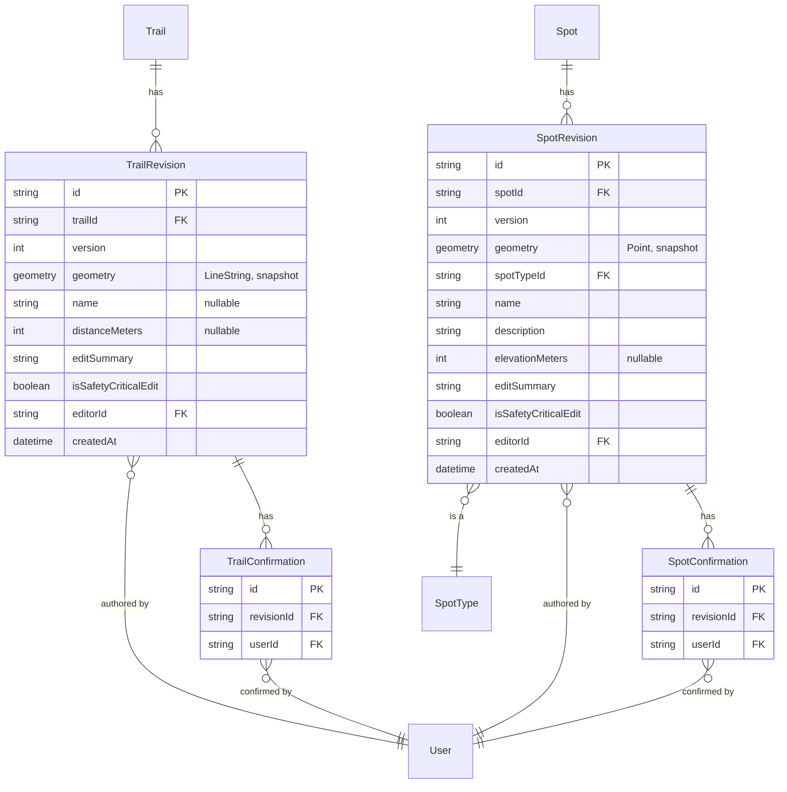

# Geodata changeset history

Full OSM-style changeset history for `Trail`/`Spot`, closing the gap FEATURE.md §4 names as "a real gap": `PageConfirmation` ties to a specific revision precisely so an edit can't ride on stale trust, and geodata has no revision to tie to — until this doc. Companion to FEATURE.md §3 (`PageRevision`/`PageConfirmation`, the pattern mirrored here) and §4 (the tables being versioned). Depends on nothing else being built first; supersedes FEATURE.md §4's service-layer confirmation-reset rule once implemented.

**Status**: designed, not built.

## Scope

Full row snapshots per edit (`TrailRevision`/`SpotRevision`, mirroring `PageRevision`), and confirmations retargeted from the row id to the revision id (mirroring `PageConfirmation`) so trust expires automatically rather than needing an explicit `deleteMany` on every edit.

Not designed here: revision retention/pruning (unbounded for now — a GPX-imported trail's revision can be a heavier snapshot than a Markdown one); a generic changeset table spanning both trails and spots (see per-table notes for why two tables were chosen instead); versioning `TrailElevationProfile` alongside geometry (see TRAIL_ELEVATION.md's open decisions).

## Schema (additions to `prisma/schema.prisma`)

```prisma
model TrailRevision {
  id                   String   @id @default(uuid())
  trailId              String
  trail                Trail    @relation(fields: [trailId], references: [id], onDelete: Cascade)
  version              Int
  // Full snapshot, not a diff - mirrors PageRevision.content. A second
  // Unsupported geometry column: hand-added GiST index, raw-SQL-only reads.
  geometry             Unsupported("geometry(LineString, 4326)")
  name                 String?
  distanceMeters       Int?
  editSummary          String?
  isSafetyCriticalEdit Boolean  @default(false)
  editorId             String
  editor               User     @relation(fields: [editorId], references: [id], onDelete: Restrict)
  createdAt            DateTime @default(now())

  confirmations TrailConfirmation[]

  @@unique([trailId, version])
  @@map("trail_revisions")
}

model SpotRevision {
  id                   String   @id @default(uuid())
  spotId               String
  spot                 Spot     @relation(fields: [spotId], references: [id], onDelete: Cascade)
  version              Int
  geometry             Unsupported("geometry(Point, 4326)")
  spotTypeId           String
  spotType             SpotType @relation(fields: [spotTypeId], references: [id], onDelete: Restrict)
  name                 String
  description          String?
  elevationMeters      Int?
  editSummary          String?
  isSafetyCriticalEdit Boolean  @default(false)
  editorId             String
  editor               User     @relation(fields: [editorId], references: [id], onDelete: Restrict)
  createdAt            DateTime @default(now())

  confirmations SpotConfirmation[]

  @@unique([spotId, version])
  @@map("spot_revisions")
}

// CHANGED, not new — retargeted from trailId to revisionId, arriving at
// exactly PageConfirmation's shape (@@unique([revisionId, userId]), no
// pageId-equivalent on this table either).
model TrailConfirmation {
  id         String        @id @default(uuid())
  revisionId String
  revision   TrailRevision @relation(fields: [revisionId], references: [id], onDelete: Cascade)
  userId     String
  user       User          @relation(fields: [userId], references: [id], onDelete: Cascade)
  createdAt  DateTime      @default(now())

  @@unique([revisionId, userId])
  @@map("trail_confirmations")
}

model SpotConfirmation {
  id         String       @id @default(uuid())
  revisionId String
  revision   SpotRevision @relation(fields: [revisionId], references: [id], onDelete: Cascade)
  userId     String
  user       User         @relation(fields: [userId], references: [id], onDelete: Cascade)
  createdAt  DateTime     @default(now())

  @@unique([revisionId, userId])
  @@map("spot_confirmations")
}
```

## Entity relationships



## Per-table notes

- **Two tables, not one polymorphic changeset.** The tempting alternative — a single `GeoChangeset` with nullable `trailId`/`spotId` — is exactly what CLAUDE.md's conventions say not to build: "prefer one duplicated-but-simple table over a shared/polymorphic one when Prisma can't express the polymorphism cleanly." The precedents are `Media` vs. `TripReportMedia` and the three separate `*Confirmation` tables already in this schema. Two geometry types with different typmods (`LineString` vs. `Point`) make the polymorphic version worse than usual here — a shared table would need a nullable geometry column typed to neither.
- **Full snapshots, never diffs** — same shape as `PageRevision.content`. Makes revert trivial (copy an old snapshot into a new revision) and the diff endpoint below simple (compare two snapshots, nothing to reconstruct).
- **A second `Unsupported` geometry column per table** — the same consequences as `Trail.geometry`/`Spot.geometry`: a hand-added GiST index per revision table, and reads go through `$queryRaw` with `ST_AsGeoJSON(geometry)::json AS geometry` in the column list, exactly like the live tables' services already do.
- **No `updatedAt`** — verified against `PageRevision`, which has `createdAt` only. Revisions are immutable, so this is an established, precedented exception to FEATURE.md §2's "`createdAt`/`updatedAt` on every table" convention, not an oversight.
- **`isSafetyCriticalEdit` finally becomes a stored column.** FEATURE.md §4's service-layer notes explain it's currently transient "since there's no permanent per-edit record to attach it to" — that reason is gone once this ships, and the transient-flag comment in the DTOs should be retired.
- **Confirmations become revision-scoped**, retargeted from `trailId`/`spotId` to `revisionId`, arriving at exactly `PageConfirmation`'s shape. Consequences:
  - **The load-bearing service rule at FEATURE.md §4 is superseded.** Confirmations are no longer deleted on edit — they go stale for free, because they point at a revision nobody is looking at any more. This is the whole point of the change.
  - **The `verificationStatus` reset stays.** It's a denormalised cache on the live `Trail`/`Spot` row, and a new revision starts at zero confirmations regardless, so it must still reset on edit. Only the `deleteMany` goes away.
  - **Counting confirmations now joins through the revision.** `CONFIRMATION_THRESHOLD = 2` still applies, but against the *current* revision's confirmations, not the row's all-time total.
  - Dropping `trailId`/`spotId` from the confirmation tables and replacing with `revisionId` is a real schema break, not an addition — see Migration notes.

## Required additions to existing models

| Existing model | Field to add |
|---|---|
| `Trail` | `revisions TrailRevision[]` |
| `Spot` | `revisions SpotRevision[]` |
| `SpotType` | `spotRevisions SpotRevision[]` |
| `User` | `trailRevisions TrailRevision[]`, `spotRevisions SpotRevision[]` |

Not added retroactively now, same reasoning as every other "required additions" table in this project's docs — added when this phase is actually implemented, to keep FEATURE.md §2's "Phase 1–5" scope honest until the migration happens.

## Migration notes — the riskiest part of this round

Four ordered steps, all raw SQL (geometry can't round-trip through Prisma's normal migration diffing):

1. Create `trail_revisions` / `spot_revisions`; hand-add `USING GIST (geometry)` indexes for both.
2. **Backfill a synthetic version-1 revision per existing active row** — geometry copied from the live row, `editorId = createdById`, `createdAt = trails.createdAt`, `editSummary = 'Imported from pre-history row'`.
3. Add `revisionId` to both confirmation tables **nullable**, backfill it to each row's version-1 revision, *then* set `NOT NULL` and swap the unique constraint from `[trailId, userId]`/`[spotId, userId]` to `[revisionId, userId]`, then drop the old `trailId`/`spotId` column. The three-step nullable→backfill→constrain sequence is mandatory — a single-step migration fails on any non-empty deployment, since existing confirmation rows have no revision to point at until step 2 has run.
4. Audit the generated SQL for spurious `DROP INDEX` lines and use `CREATE INDEX IF NOT EXISTS` throughout.

That last point is not hypothetical: `20260729063554_add_trip_groups/migration.sql` dropped both existing GiST spatial indexes on `trails`/`spots` as an auto-generated side effect of an unrelated migration, and `20260729064500_restore_geodata_indexes/migration.sql` exists solely to undo it. This round takes the count of hand-added spatial indexes from 2 to at least 4 (two new revision tables, before counting `districts_boundary_idx` from the district-tagging work in FEATURE.md §4). Migrations run automatically on API container startup, so a bad one breaks the deploy.

**The version race**: mirror `AdventurePagesService.submitRevision`'s pattern — `findFirst({ orderBy: { version: 'desc' } })` then `(latest?.version ?? 0) + 1`, guarded only by the `@@unique` constraint, no row lock. Two simultaneous edits produce a unique-constraint error on one of them, identical to the behaviour `PageRevision` already ships with. Named as a limitation rather than fixed here — fixing it in one layer and not the other would be worse than the shared bug; `SELECT ... FOR UPDATE` is the fix if concurrent geodata editing ever becomes real.

## Service-layer notes

- **Create**: `Trail`/`Spot` insert gains a `version: 1` revision in the same transaction, mirroring `AdventurePagesService.create()`'s page+revision transaction.
- **Edit**: inside the existing `update()` transaction — (a) the live-row `$executeRaw` UPDATE, unchanged; (b) create the new revision from the post-update row's geometry (`ST_AsGeoJSON(geometry)::json`); (c) the `verificationStatus` cache write, unchanged. The `tx.trailConfirmation.deleteMany(...)` call is **removed** — this is the one line of existing code this doc deletes.
- **Confirm**: resolves the current revision, then upserts `(revisionId, userId)` and counts against it — same shape as `AdventurePagesService.confirm()`.
- **Revert**: creates a **new** revision copying the target snapshot forward, `editSummary: "Reverted to version N"`, never a delete or pointer move — per `revert` in FEATURE.md §3's service-layer notes.

## Diffing geometry

`diffLines` from the `diff` npm package is meaningless for a LineString, so geodata diverges from adventure pages here. `GET /trails/:id/diff?from=&to=` returns:

- **Scalar field changes** — a simple changed-fields list (`name`, `distanceMeters`, `spotTypeId`, ...), old and new values.
- **Geometry summary stats**, computed in PostGIS since the geometry is already raw-SQL-only: `ST_NPoints` delta (vertices added/removed), `ST_Length(::geography)` delta in metres (reusing the exact cast already used at trail-create time), `ST_HausdorffDistance` as "maximum deviation," and a `geometryChanged` boolean from `ST_Equals`.
- **Both geometries as GeoJSON**, so the UI can overlay them.

The visual diff is then free: feed old and new geometry to the existing `AdventureMap` component, old rendered muted/dashed, new solid — no new map component needed, and it's more useful than a text diff would have been anyway.

## API (`apps/api/src/geodata/`)

Mirrors the adventure-pages revision surface, with one deliberate divergence:

| Endpoint | Note |
|---|---|
| `GET /trails/:id/revisions` | `@Public()`, metadata-only select (no geometry), mirroring `listRevisions` |
| `GET /trails/:id/revisions/:version` | `@Public()`, includes geometry as GeoJSON |
| `GET /trails/:id/diff?from=&to=` | `@Public()`, shape above |
| `POST /trails/:id/revisions/:version/revert` | New revision copying the old snapshot; never a delete or pointer move |

...and the same four under `/spots/:id/...`.

**The divergence**: adventure pages create revisions via `POST :id/revisions`, but geodata edits already go through `PATCH /trails/:id`/`PATCH /spots/:id`. This doc keeps `PATCH` as the entry point and creates the revision as a transactional side effect, rather than adding a second write path — churning the existing contribute UI to a new verb would buy nothing. Recorded as a considered inconsistency with the adventure-pages API, not an oversight.

## Public UI (`apps/public/src/routes/adventures/$slug/`)

- `trails/$trailId/history/index.tsx` and `.../history/$version.tsx` — reuse the timeline markup from the existing adventure-page history route (dot-and-line timeline, `v{n}` link, safety-critical badge, `editSummary`), plus the vertex/length scalars and the old/new map overlay for `$version.tsx` when `version > 1`.
- `spots/$spotId/history/index.tsx` and `.../history/$version.tsx` — same shape.

## Admin (`apps/admin/src/resources/`)

`trails/TrailShow.tsx` and `spots/SpotShow.tsx` gain a read-only revision timeline below the existing embedded map, each row expandable into a per-revision map plus the diff stats, and a revert action reusing the public endpoint. No new Refine resource entry — revisions aren't independently CRUDable, staying inside the existing "read + moderate, not full authoring" boundary for admin.

## Open decisions

1. **Concurrent-edit version collision** — see the version race noted in Migration notes; deliberately left unfixed here, matching `PageRevision`'s existing shipped behaviour.
2. **Backfilled confirmation precision** — attaching existing confirmations to the synthetic v1 revision is the most accurate reconstruction available, but is not literally "this user vouched for this exact snapshot." The alternative (wiping all confirmations at migration time) would flip every currently-VERIFIED trail/spot back to UNVERIFIED on a live site — attach wins, but it's a one-way door worth recording.
3. **`Trail`/`Spot.verificationStatus` stays denormalized**, not derived from the latest revision's confirmation count via a join — the bbox/list read paths shouldn't need a join to render a badge. Revisit if it drifts in practice.
4. **Revision retention** — unbounded. A GPX-imported trail's revision (see TRAIL_ELEVATION.md) is a heavier snapshot than a Markdown one; no pruning designed.
5. **Should reverting be admin-gated?** — currently open to any signed-in user, mirroring adventure pages.
6. **Should a `spotTypeId` change auto-flag as safety-critical?** — a hazard → viewpoint change is a meaningful downgrade, but inferring intent from a field change is a product call, not a schema one.
7. **Whether `TrailElevationProfile` (TRAIL_ELEVATION.md) is versioned alongside geometry, or stays current-state-only.**
8. **Whether soft-deleting a trail/spot retains its revisions** — it should, but confirm against the `isActive` convention when implemented.
9. **Whether revert re-runs district derivation** (FEATURE.md §4's district-tagging design) for the restored geometry.
