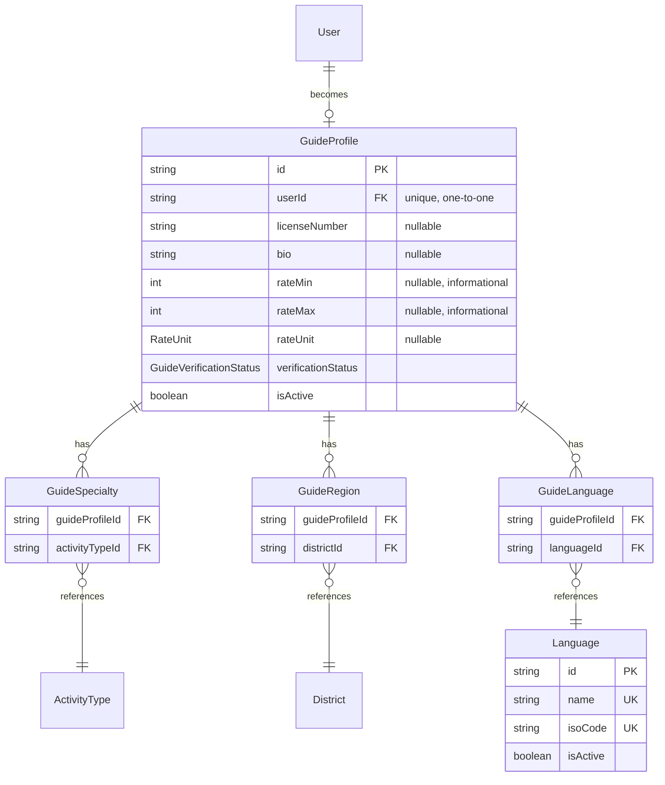

# Guide directory

Design for IDEA.md's "Connect" pillar: "a free guide directory. Profiles show certifications, languages, specialties, regions, rate range. No in-app payment or commission. Restricted-region guides need license verification before being marked verified." Companion to [DATABASE.md](DATABASE.md) (extends `User`, `ActivityType`, `District`).

**Status**: built (Phase 9) — public guide directory, profile pages, and a create/edit-your-own-profile form; admin got the manual license verification review queue this doc called for (list/show + a `PATCH .../verification-status` action) in the admin-beyond-master-data pass. One thing has changed since: `rateUnit` was converted from free text to a `RateUnit` enum in Phase 13 (via a data-preserving migration, not a drop+recreate) — see the schema and per-table note below, updated to match.

## Scope and the trust model here is different again

Like trip reports (TRIP_REPORTS.md), this needed its own answer to "does this reuse the content trust model," and the answer is no, but for the opposite reason: this trust axis is *more* rigorous than content verification, not less. `PageVerificationStatus`/`GeoVerificationStatus` promote via peer confirmation counts — fine for "is this trail description accurate," meaningless for "does this person actually hold a real trekking guide license." Guide verification is modeled as its own enum, `GuideVerificationStatus`, promoted only by manual moderator review, never automatically.

This is also a **separate axis from `User.role`**. `role` (`ADMIN`/`USER`) is platform permissions — what a user is allowed to do in the app. `GuideProfile.verificationStatus` is real-world credential trust — whether to actually believe someone's license claim. An admin isn't automatically a verified guide, and a verified guide isn't automatically an admin.

## Schema (additions to `prisma/schema.prisma`)

```prisma
enum GuideVerificationStatus {
  UNVERIFIED
  PENDING_LICENSE_REVIEW
  VERIFIED
}

// Phase 13: replaced the original free-text rateUnit
enum RateUnit {
  PER_DAY
  PER_TRIP
  PER_HOUR
}

model Language {
  id        String   @id @default(uuid())
  name      String   @unique
  isoCode   String   @unique // ISO 639-1, e.g. "en", "ne"
  isActive  Boolean  @default(true)
  sortOrder Int      @default(0)
  createdAt DateTime @default(now())
  updatedAt DateTime @updatedAt

  guideLanguages GuideLanguage[]

  @@map("languages")
}

model GuideProfile {
  id                 String   @id @default(uuid())
  userId             String   @unique
  user               User     @relation(fields: [userId], references: [id], onDelete: Cascade)
  licenseNumber      String?
  bio                String?
  rateMin            Int?
  rateMax            Int?
  rateUnit           RateUnit?
  verificationStatus GuideVerificationStatus @default(UNVERIFIED)
  isActive           Boolean  @default(true)
  createdAt          DateTime @default(now())
  updatedAt          DateTime @updatedAt

  specialties GuideSpecialty[]
  regions     GuideRegion[]
  languages   GuideLanguage[]

  @@map("guide_profiles")
}

model GuideSpecialty {
  id             String   @id @default(uuid())
  guideProfileId String
  guideProfile   GuideProfile @relation(fields: [guideProfileId], references: [id], onDelete: Cascade)
  activityTypeId String
  activityType   ActivityType @relation(fields: [activityTypeId], references: [id], onDelete: Restrict)

  @@unique([guideProfileId, activityTypeId])
  @@map("guide_specialties")
}

model GuideRegion {
  id             String   @id @default(uuid())
  guideProfileId String
  guideProfile   GuideProfile @relation(fields: [guideProfileId], references: [id], onDelete: Cascade)
  districtId     String
  district       District     @relation(fields: [districtId], references: [id], onDelete: Restrict)

  @@unique([guideProfileId, districtId])
  @@map("guide_regions")
}

model GuideLanguage {
  id             String   @id @default(uuid())
  guideProfileId String
  guideProfile   GuideProfile @relation(fields: [guideProfileId], references: [id], onDelete: Cascade)
  languageId     String
  language       Language     @relation(fields: [languageId], references: [id], onDelete: Restrict)

  @@unique([guideProfileId, languageId])
  @@map("guide_languages")
}
```

## Entity relationships



## Per-table notes

- **`GuideProfile` is a 1:1 extension of `User`**, same pattern as `Profile` — a user becomes a guide by gaining this row, not by being a different account type. `onDelete: Cascade` from `User`, matching `Profile`'s reasoning (exclusively owned, no reason for it to outlive the user).
- **`Language` is new master data**, same flat shape as `DifficultyLevel`/`Season` — nothing in the schema modeled spoken languages before this. `isoCode` (ISO 639-1) is the stable identifier; `name` is the display label, same name/slug-equivalent split reasoning used everywhere else.
- **Specialties/regions/languages are all many-to-many join tables** — a guide can specialize in more than one activity, cover more than one district, and speak more than one language. Same shape and `onDelete` reasoning as `AdventurePageDistrict`/`AdventurePageSeason`: `Cascade` from the owning `GuideProfile`, `Restrict` toward the shared lookup table.
- **`rateMin`/`rateMax`/`rateUnit` are informational only** — IDEA.md is explicit that there's no in-app payment or commission, so these fields exist purely for display on the guide's profile, never referenced by any transaction logic (there isn't one). `rateUnit` was originally free text; Phase 13 converted it to the `RateUnit` enum above via a data-preserving migration (`ADD COLUMN` + `UPDATE ... CASE` pattern-matching the old free text, then drop the old column and rename) rather than a naive drop-and-recreate, so existing profiles' rates didn't silently go blank.
- **Restricted-region enforcement depends on a new `District` field**: IDEA.md's real legal constraint — Annapurna, Manaslu, and Upper Mustang require a registered trekking agency for permits — means the platform needs to know *which* districts carry that requirement. Proposed as a **required addition to the already-finalized `District` model**: `requiresRegisteredAgency Boolean @default(false)`. This is a genuine new column on an existing table, not just a reverse-relation array field like the other "required additions" tables in ADVENTURE_PAGES.md/MAP_GEODATA.md — flagged clearly for that reason. Service-layer rule: if any of a `GuideProfile`'s `GuideRegion` rows reference a district where `requiresRegisteredAgency = true`, that guide's `verificationStatus` can only reach `VERIFIED` by passing through `PENDING_LICENSE_REVIEW` (a human actually checking the license) — never a shortcut path. Guides who only cover non-restricted districts could plausibly have a lighter verification bar, but that policy detail belongs to the service layer, not the schema.

## Required additions to existing models

| Existing model | Field to add |
|---|---|
| `User` | `guideProfile GuideProfile?` |
| `ActivityType` | `guideSpecialties GuideSpecialty[]` |
| `District` | `guideRegions GuideRegion[]`, **and** `requiresRegisteredAgency Boolean @default(false)` (an actual new column, not just a relation array — see note above) |

Not added retroactively now, same reasoning as every other "required additions" table in this project's docs — added when this phase is actually implemented.
