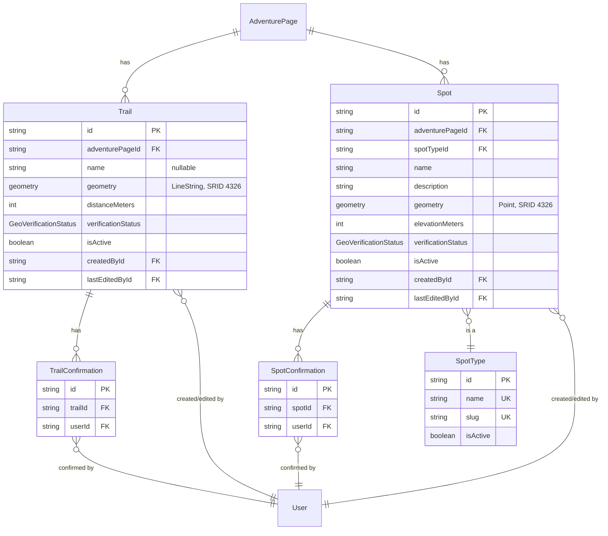

# Map / geodata layer

Design for IDEA.md's "Geodata" layer (inherited from OpenStreetMap): trails and spots as editable geodata. The last of IDEA.md's three inherited layers to get designed — the Article layer is [ADVENTURE_PAGES.md](ADVENTURE_PAGES.md), the Phase 1–5 foundation is [ARCHITECTURE.md](ARCHITECTURE.md)/[DATABASE.md](DATABASE.md). PostGIS has been enabled on the `db` container since Phase 1 specifically so this phase wouldn't need a migration to add the extension (see ROADMAP.md's stack section).

Nothing here is migrated yet — schema to implement in whatever phase actually builds this.

## Scope

- **`Trail`** — a route's path, `LineString` geometry, exclusive to one `AdventurePage` (a page can have multiple trail segments, e.g. an alternate route, but each `Trail` belongs to exactly one page — a shared trailhead across two different treks is two separate overlapping `Trail` rows, not one shared record).
- **`Spot`** — a point of interest along a route (teahouse, viewpoint, water source, hazard, trailhead, ...), `Point` geometry, also exclusive to one page, for the same consistency reason as `Trail`.
- **`SpotType`** — a master-data lookup table for spot categories, same pattern as `ActivityType`/`DifficultyLevel`/`Season`, community-extensible without a migration.

Not designed here, flagged for later: elevation-along-path profiles (`AdventurePage.maxAltitudeMeters` already covers "how high" as a single scalar; a full 3D `LineStringZ` profile is new complexity, not needed yet); deriving `AdventurePageDistrict` tags spatially from `Trail` geometry (would need district boundary polygons, which `District` doesn't have); full OSM-style changeset history (see the versioning tradeoff below).

## Schema (additions to `prisma/schema.prisma`)

```prisma
enum GeoVerificationStatus {
  UNVERIFIED
  VERIFIED
  NEEDS_REVIEW
}

model SpotType {
  id          String   @id @default(uuid())
  name        String   @unique
  slug        String   @unique
  description String?
  sortOrder   Int      @default(0)
  isActive    Boolean  @default(true)
  createdAt   DateTime @default(now())
  updatedAt   DateTime @updatedAt

  spots Spot[]

  @@map("spot_types")
}

model Trail {
  id                 String   @id @default(uuid())
  adventurePageId    String
  adventurePage      AdventurePage @relation(fields: [adventurePageId], references: [id], onDelete: Cascade)
  name               String?
  geometry           Unsupported("geometry(LineString, 4326)")
  distanceMeters     Int?
  verificationStatus GeoVerificationStatus @default(UNVERIFIED)
  isActive           Boolean  @default(true)
  createdById        String
  createdBy          User     @relation("TrailCreatedBy", fields: [createdById], references: [id], onDelete: Restrict)
  lastEditedById     String
  lastEditedBy       User     @relation("TrailLastEditedBy", fields: [lastEditedById], references: [id], onDelete: Restrict)
  createdAt          DateTime @default(now())
  updatedAt          DateTime @updatedAt

  confirmations TrailConfirmation[]

  @@map("trails")
}

model TrailConfirmation {
  id        String   @id @default(uuid())
  trailId   String
  trail     Trail    @relation(fields: [trailId], references: [id], onDelete: Cascade)
  userId    String
  user      User     @relation(fields: [userId], references: [id], onDelete: Cascade)
  createdAt DateTime @default(now())

  @@unique([trailId, userId])
  @@map("trail_confirmations")
}

model Spot {
  id                 String   @id @default(uuid())
  adventurePageId    String
  adventurePage      AdventurePage @relation(fields: [adventurePageId], references: [id], onDelete: Cascade)
  spotTypeId         String
  spotType           SpotType @relation(fields: [spotTypeId], references: [id], onDelete: Restrict)
  name               String
  description        String?
  geometry           Unsupported("geometry(Point, 4326)")
  elevationMeters    Int?
  verificationStatus GeoVerificationStatus @default(UNVERIFIED)
  isActive           Boolean  @default(true)
  createdById        String
  createdBy          User     @relation("SpotCreatedBy", fields: [createdById], references: [id], onDelete: Restrict)
  lastEditedById     String
  lastEditedBy       User     @relation("SpotLastEditedBy", fields: [lastEditedById], references: [id], onDelete: Restrict)
  createdAt          DateTime @default(now())
  updatedAt          DateTime @updatedAt

  confirmations SpotConfirmation[]

  @@map("spots")
}

model SpotConfirmation {
  id        String   @id @default(uuid())
  spotId    String
  spot      Spot     @relation(fields: [spotId], references: [id], onDelete: Cascade)
  userId    String
  user      User     @relation(fields: [userId], references: [id], onDelete: Cascade)
  createdAt DateTime @default(now())

  @@unique([spotId, userId])
  @@map("spot_confirmations")
}
```

## Entity relationships



## Per-table notes

- **`Trail`/`Spot` are exclusive to one `AdventurePage`** (`onDelete: Cascade` from the page) — deliberately simple: no shared/many-to-many trail or spot records. A landmark or teahouse that comes up on two different treks is two separate rows with the same real-world coordinates, not one row referenced twice. Matches the same reasoning already applied to `AdventurePageDistrict`/`AdventurePageSeason` favoring simplicity over modeling every real-world sharing relationship.
- **No revision history, unlike `PageRevision`.** Editing a `Trail`/`Spot` updates the row in place; history is just "created by" + "last edited by," not a full changeset log. This is a deliberate simplification versus true OSM-style history, appropriate for a solo project's current scale — but it creates a real gap: `PageConfirmation` ties to a specific *revision* precisely so an edit can't ride on stale trust, and geodata has no revision to tie to. The mitigation is a **service-layer rule, not a schema constraint**: any edit to geometry or key fields must reset `verificationStatus` and delete existing confirmation rows in the same transaction. If this rule isn't enforced in code, a `Trail`'s geometry could be silently moved while it still shows as "verified" from confirmations that applied to the old path — worth remembering as a correctness requirement, not just a nice-to-have.
- **`createdById` and `lastEditedById` are separate fields**, both required, both `onDelete: Restrict` (same reasoning as `PageRevision.editorId` — don't lose attribution to a hard-deleted user). Tracking both "who added this" and "who last touched it" is the minimal accountability trail this simplified model can offer without full history.
- **`geometry` columns are `Unsupported(...)`** — Prisma can't natively type, validate, or index PostGIS geometry columns. Two concrete implications: the GiST spatial index has to be hand-added to the generated SQL migration (`CREATE INDEX ... USING GIST (geometry)`), and any spatial query (map viewport bounding box, "spots within N meters") has to go through `$queryRaw`/`$executeRaw` with real PostGIS functions (`ST_Intersects`, `ST_DWithin`, ...) rather than Prisma's normal query builder, which simply can't see this column.
- **`SpotType` is flat, not nested** — unlike `ActivityType`, spot categories (teahouse, viewpoint, hazard, ...) don't have an obvious natural hierarchy the way activity types do (trekking → teahouse trekking); kept as a plain lookup, same shape as `DifficultyLevel`/`Season`.
- **`distanceMeters`/`elevationMeters` are cached scalars, not derived on every read** — computed once (e.g. via `ST_Length` after reprojecting to a metric SRID, or application-side) and stored, rather than recalculated from geometry on every request.

## Required additions to existing models

| Existing model | Field to add |
|---|---|
| `AdventurePage` | `trails Trail[]`, `spots Spot[]` |
| `User` | `createdTrails Trail[] @relation("TrailCreatedBy")`, `lastEditedTrails Trail[] @relation("TrailLastEditedBy")`, `trailConfirmations TrailConfirmation[]`, `createdSpots Spot[] @relation("SpotCreatedBy")`, `lastEditedSpots Spot[] @relation("SpotLastEditedBy")`, `spotConfirmations SpotConfirmation[]` |

Not added retroactively now, same reasoning as ADVENTURE_PAGES.md's equivalent table — added when this phase is actually implemented, to keep DATABASE.md's "Phase 1–5" scope honest until the migration happens.

## Migration notes

- `npx prisma migrate dev` generates the tables above, but the GiST spatial index isn't expressible in the Prisma schema — hand-add to the generated migration SQL:
  ```sql
  CREATE INDEX trails_geometry_idx ON trails USING GIST (geometry);
  CREATE INDEX spots_geometry_idx ON spots USING GIST (geometry);
  ```
- SRID 4326 (WGS84 lat/lng) is the standard choice for storing raw GPS-style coordinates — matches what any map tile provider or GPX import will hand you.

## Service-layer notes

- **Create**: `Trail`/`Spot` insert always requires `adventurePageId` — can't exist unattached to a page.
- **Edit**: any update to geometry or key fields resets `verificationStatus` (to `UNVERIFIED`, or `NEEDS_REVIEW` if the submitter flags the edit as safety-critical — a transient flag on the update request, not a stored column, since there's no permanent per-edit record to attach it to) **and** deletes the row's existing confirmations, in the same transaction. This is the load-bearing rule replacing what `PageConfirmation`'s revision-scoping did for free in the content layer.
- **Confirm**: upsert a `TrailConfirmation`/`SpotConfirmation` for `(row, current user)`; crossing a threshold (a config value, not a schema concept, same as `PageConfirmation`) flips `verificationStatus` to `VERIFIED`.
