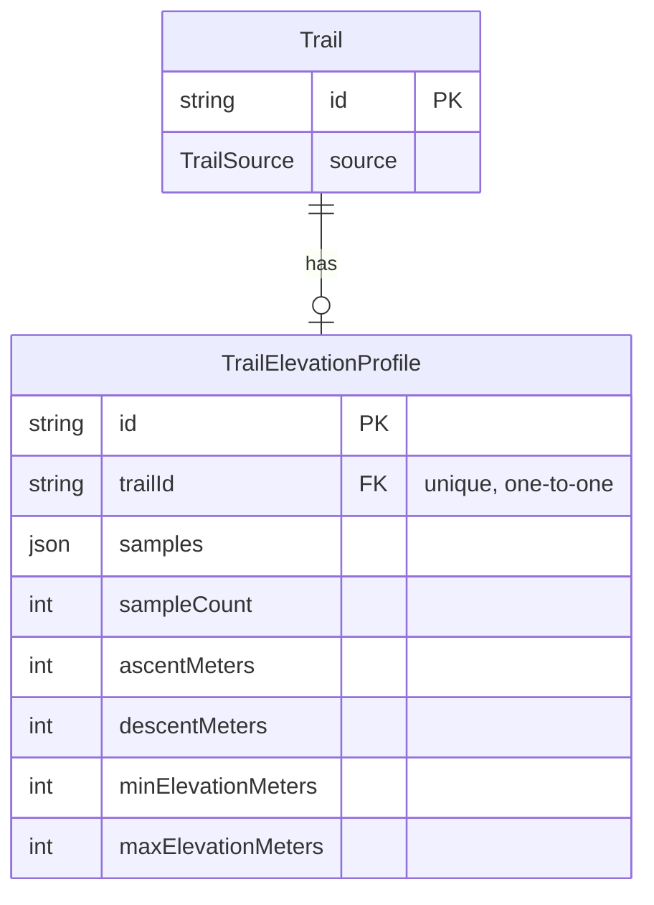

# Trail elevation — GPX import + elevation profiles

Elevation-along-path profiles for trails, sourced from uploaded GPX tracks. Companion to FEATURE.md §4 (`Trail`/`Spot`, the tables this extends), GEODATA_HISTORY.md (the profile-invalidation rule here is a second instance of that doc's/FEATURE.md §4's load-bearing edit-resets-trust rule), and ACTIVITY_TRACKS.md (shares this doc's GPX parser module and sample-sidecar pattern; extends `TrailSource` with `RECORDED_ACTIVITY`; resolves the multi-`<trkseg>` open question below). Depends on nothing else being built first.

**Status**: built (Milestone 2 Phase 16, together with ACTIVITY_TRACKS.md - see FEATURE.md §1). Schema, GPX import, the invalidation rule, admin + public UI are all live; this doc is kept as the design record.

## Scope

There is **no GPX import anywhere in the repo today** — `apps/api/src/uploads/` is images-only, and trails are created solely by clicking points on `DrawMap`. "Elevation from uploaded GPX" therefore has an unmet prerequisite, so this doc designs the import alongside the profile it feeds — treated as one deliverable, not two, since GPX import is also a materially better trail-creation path than clicking a polyline by hand.

Not designed here: DEM/SRTM-derived elevation, any external elevation API — elevation exists only where a GPX track supplied it. Auto-filling `Spot.elevationMeters` from a nearby trail profile is flagged as an open decision, not designed.

## Core design decision: a sidecar profile table, not `LineStringZ`

FEATURE.md §4 deferred elevation partly because "a full 3D `LineStringZ` profile is new complexity" — that reasoning still holds, so elevation does not go into the geometry column. Instead a 1:1 sidecar table holds the sample series plus cached aggregates.

Why not `LineStringZ`:
- `Trail.geometry` is `Unsupported("geometry(LineString, 4326)")` — the typmod forbids Z, so adopting it means an `ST_Force3D` migration over every existing row and a mixed-dimensionality world (hand-drawn trails have no Z).
- `ST_AsGeoJSON` would start emitting 3-element coordinates into `AdventureMap`'s `GeoJSON.LineString` contract and into admin's `GeometryMap`. Leaflet tolerates it, but the type contract silently changes for every map consumer.
- A chart needs `(distanceAlongPath, elevation)` pairs, not raw vertices. Deriving that from geometry on every read contradicts FEATURE.md §4's cached-scalar convention (`distanceMeters`/`elevationMeters` are computed once and stored, not recalculated per request).

A sidecar table keeps the `Trail` row lean (every geodata read is an explicit-column `$queryRaw` select, so the profile is simply not selected unless asked for), adds no new `Unsupported` column, and makes "has no profile" a row absence rather than a null blob.

## Schema (additions to `prisma/schema.prisma`)

```prisma
enum TrailSource {
  DRAWN              // clicked vertex-by-vertex in DrawMap
  GPX_IMPORT         // parsed from an uploaded .gpx track
  RECORDED_ACTIVITY  // promoted from a user's own ActivityTrack — see ACTIVITY_TRACKS.md
}

model TrailElevationProfile {
  id                 String   @id @default(uuid())
  trailId            String   @unique
  trail              Trail    @relation(fields: [trailId], references: [id], onDelete: Cascade)
  // [{ d: <metres along path>, e: <metres elevation> }, ...] - a whole-object
  // read, never queried into, so Json beats a samples table with 500+ rows/trail
  samples            Json
  sampleCount        Int
  ascentMeters       Int
  descentMeters      Int
  minElevationMeters Int
  maxElevationMeters Int
  createdAt          DateTime @default(now())
  updatedAt          DateTime @updatedAt

  @@map("trail_elevation_profiles")
}
```

Plus on `Trail`: `source TrailSource @default(DRAWN)` and `elevationProfile TrailElevationProfile?`.

## Entity relationships



## Per-table notes

- **`onDelete: Cascade`** — a profile is owned exclusively by its trail, matching CLAUDE.md's stated rule for parent-owned content (e.g. `Profile`→`User`, `PageRevision`→`AdventurePage`).
- **`samples` is `Json`, not a normalized samples table** — it's read as a whole object to plot a chart, never queried into (no "find trails with elevation > X at point Y"). A 500-row-per-trail normalized table would be pure overhead for that access pattern.
- **`source TrailSource` on `Trail`** records provenance (hand-drawn vs. GPX-imported) independent of whether a profile exists — a GPX import with no `<ele>` data still sets `source: GPX_IMPORT` but creates no `TrailElevationProfile` row.

## The invalidation rule (this doc's most important paragraph)

**Editing a trail's geometry deletes its elevation profile, in the same transaction as the confirmation invalidation described in GEODATA_HISTORY.md.** A profile is only meaningful for the exact path it was derived from; a moved path with a stale profile is the same class of lie as a moved path with stale confirmations. This is a second instance of FEATURE.md §4's load-bearing service-layer rule (edits must not let stale trust/derived-state ride along), not a new concept.

**This must be geometry-conditional, not unconditional.** The existing `update()` resets verification on *any* update today; a naive copy of that behaviour would delete a trail's elevation profile just because its name was edited. The profile delete should fire only when the geometry itself changes — a deliberate, explicit divergence from the broader confirmation-reset rule, worth stating so implementation doesn't copy the wrong scope by reflex.

## GPX import

- **Endpoint**: `POST /adventure-pages/:pageId/trails/import-gpx`, multipart. Mirrors the existing page-scoped `AdventurePageTrailsController` pattern.
- **Parse server-side, never client-side.** The same "don't trust the client to keep derived state honest" instinct CLAUDE.md records for `searchVector` and `verificationStatus`: the client uploads raw bytes, the server produces geometry, samples, and aggregates.
- **Parser**: `fast-xml-parser` plus a small hand-written mapper, not `@tmcw/togeojson` (which wants a DOM and would need a shim in the API container). Dependency-light, matching the repo's minimal-dependency character (hand-rolled SVG elsewhere, no chart library, raw SQL for spatial queries). This parser module is shared with ACTIVITY_TRACKS.md's importer (`apps/api/src/tracks/parsers/gpx.parser.ts`) — one parser, two destinations, not two parsers.
- **One transaction** creates the `Trail` (geometry via the existing `ST_SetSRID(ST_GeomFromGeoJSON(...), 4326)` + `ST_Length(...::geography)::int` distance computation already used for hand-drawn trails) and its `TrailElevationProfile`, with `source: GPX_IMPORT`.
- **Guardrails**:
  - Max upload file size (reuse the existing `MAX_UPLOAD_SIZE_MB` convention from the images upload endpoint, or a GPX-specific limit).
  - A max-vertex cap with Douglas–Peucker/`ST_Simplify` applied on import — a 10 km GPS track is easily 5,000 points, and the existing bbox query has no `LIMIT` or simplification, so an unsimplified import would degrade every map view that loads it.
  - Reject files with no `<trkpt>` elements.
  - Reject tracks whose bounding box falls entirely outside Nepal.
  - Missing `<ele>` on some/all points: import the geometry, skip creating a profile rather than failing the whole import.
- **Privacy**: discard `<time>` elements during parsing for *this* endpoint. A raw GPX track reveals exactly when a person was at each coordinate, and this is a public, anonymously-readable site — much cheaper to decide against storing that now than to retrofit a redaction pass later. This is a property of the destination, not the parser: ACTIVITY_TRACKS.md's `POST /activity-tracks/import` uses the same shared parser but keeps `<time>`, because a user-owned, private-by-default `ActivityTrack` has legitimate use for timestamps (pace, moving time) that a public wiki `Trail` never does. Read both endpoints' handling as one rule applied at two destinations, not a contradiction.

## Required additions to existing models

| Existing model | Field to add |
|---|---|
| `Trail` | `source TrailSource @default(DRAWN)`, `elevationProfile TrailElevationProfile?` |

**Applied** — see `apps/api/prisma/migrations/20260731120000_trail_elevation_and_activity_tracks` and the live schema.

## API (`apps/api/src/geodata/`)

| Endpoint | Note |
|---|---|
| `POST /adventure-pages/:pageId/trails/import-gpx` | multipart, auth required, one transaction as above |
| `GET /trails/:id` | response gains `elevationProfile` (aggregates + samples) when present, `source` field |
| `DELETE /trails/:id/elevation-profile` | admin-only escape hatch for a bad import, deletes the profile without touching the trail |

## Public UI (`apps/public/src/routes/adventures/$slug/`)

- `trails/new.tsx` gains a GPX-upload path alongside the existing `LazyDrawMap` draw flow — a mode toggle, not a separate route.
- The adventure page view's `TrailsAndSpotsSection` gains an elevation chart beneath the map for trails with a profile, plus ascent/descent figures in the trail row.
- **New component**: `apps/public/src/components/ElevationProfile.tsx` — inline SVG, no charting library, consistent with `TopoLines.tsx` already being hand-rolled SVG and the no-CDN/no-API-key ethos elsewhere in the app. *(Build-time note, not a doc requirement: whoever implements this component should load the `dataviz` skill first — this doc only specifies that the component exists and what it plots.)*

## Admin (`apps/admin/src/resources/trails/`)

`TrailShow.tsx` shows the profile's aggregates (ascent, descent, min/max elevation) and a "delete profile" action for a bad import.

## Open decisions

1. ~~Whether GPX import may update an existing trail's geometry, or only create new trails.~~ **Implemented as the simplest version: only creates.** `POST /adventure-pages/:pageId/trails/import-gpx` always inserts a new `Trail`; a multi-`<trk>` file only uses the first track (a Trail is one LineString, and multi-track files are ACTIVITY_TRACKS.md's territory).
2. **Whether `Spot.elevationMeters` should be auto-filled from a nearby trail profile** instead of staying hand-entered. Not designed, not built.
3. ~~Whether multi-`<trkseg>` GPX files become one trail or several.~~ **Resolved in ACTIVITY_TRACKS.md and implemented**: segments join into one track/trail (a segment break is GPS signal loss, not a new activity); separate `<trk>` elements become separate tracks/trails.
4. **Whether `TrailElevationProfile` is versioned alongside `TrailRevision`** (GEODATA_HISTORY.md) or stays current-state-only. **Implemented as current-state-only** — no `TrailElevationProfileRevision` table; the profile is deleted (not versioned) on a geometry-changing edit, per the invalidation rule above.
