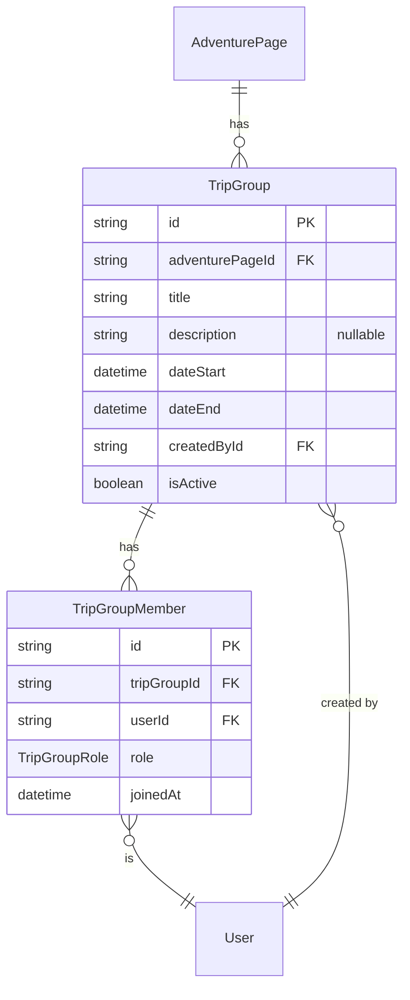

# Trip-companion groups — the Community pillar

Design for IDEA.md's "Community (trip companions)" pillar: "Strava-clubs-style groups around a shared route + date window (e.g. 'EBC, Sept 15–25'). Safety in numbers, cost-splitting, social connection." This was the one core IDEA.md pillar with no design doc through Phase 10 — **built in Phase 12**, after the deferred list in ROADMAP.md was revisited. Companion to [ADVENTURE_PAGES.md](ADVENTURE_PAGES.md) (a group is anchored to one page) and [PUBLIC_PAGES.md](PUBLIC_PAGES.md) (the public routes below extend that page inventory).

Implemented at `apps/api/src/trip-groups/`, `apps/public/src/routes/adventures/$slug/groups/`, `apps/admin/src/resources/trip-groups/`.

## Scope

A `TripGroup` is a shared route + date window to find companions for — membership metadata, not a chat room. **Deliberately no messaging model**: IDEA.md keeps guide contact informational-only and is silent on user-to-user messaging beyond that; adding a chat layer here would be scope creep beyond what the pillar actually asks for. Once people have found each other through a group, coordination happens off-platform.

Not designed here, flagged for later: in-app messaging/notifications (see ROADMAP.md's Deferred list — a `Notification` model for one-way system events is a separate, smaller idea from group chat), group size limits, join-approval gating (see Open decisions below).

## Schema (`prisma/schema.prisma`)

```prisma
enum TripGroupRole {
  ORGANIZER
  MEMBER
}

model TripGroup {
  id              String   @id @default(uuid())
  adventurePageId String
  adventurePage   AdventurePage @relation(fields: [adventurePageId], references: [id], onDelete: Cascade)
  title           String
  description     String?
  dateStart       DateTime
  dateEnd         DateTime
  createdById     String
  createdBy       User     @relation(fields: [createdById], references: [id], onDelete: Restrict)
  isActive        Boolean  @default(true)
  createdAt       DateTime @default(now())
  updatedAt       DateTime @updatedAt

  members TripGroupMember[]

  @@map("trip_groups")
}

model TripGroupMember {
  id          String   @id @default(uuid())
  tripGroupId String
  tripGroup   TripGroup @relation(fields: [tripGroupId], references: [id], onDelete: Cascade)
  userId      String
  user        User      @relation(fields: [userId], references: [id], onDelete: Cascade)
  role        TripGroupRole @default(MEMBER)
  joinedAt    DateTime  @default(now())

  @@unique([tripGroupId, userId])
  @@map("trip_group_members")
}
```

## Entity relationships



## Per-table notes

- **`TripGroup` is exclusive to one `AdventurePage`** (`onDelete: Cascade`), same ownership pattern as `TripReport`/`Trail`/`Spot` — a group only makes sense attached to the route it's for.
- **Creating a group and joining it as `ORGANIZER` happen in one transaction** — the same compound-operation pattern as `AdventurePage`+`PageRevision`. A group with zero members would be meaningless, so `TripGroupsService.create()` inserts the `TripGroup` row and its first `TripGroupMember` (role `ORGANIZER`) together. `createdById` on `TripGroup` is slightly redundant with that membership row but kept for a cheap "who started this" display without filtering members by role.
- **`role` is a two-value enum, not a richer permission system** — `ORGANIZER` can edit/cancel the group, any member can leave, that's the entire permission surface for v1. `@@unique([tripGroupId, userId])` stops joining the same group twice.
- **No messaging model** — see Scope above. Coordination is off-platform once companions have connected.
- **`isActive` soft delete**, same convention as everywhere else — "cancel group" is `isActive = false`, not a hard delete.

## Required additions to existing models

| Existing model | Field to add |
|---|---|
| `AdventurePage` | `tripGroups TripGroup[]` |
| `User` | `createdTripGroups TripGroup[]`, `tripGroupMemberships TripGroupMember[]` |

Unlike the equivalent tables in ADVENTURE_PAGES.md/MAP_GEODATA.md/TRIP_REPORTS.md/GUIDES.md, these were applied immediately rather than deferred — this phase actually shipped, so there's no "Phase 1–5 scope" honesty to preserve here.

## API (`apps/api/src/trip-groups/`)

Mirrors `trip-reports`'s two-controller shape:

- `GET/POST /adventure-pages/:pageId/trip-groups` — list is `@Public()` (supports an `upcoming=true|false` filter on `dateEnd`, though the public UI doesn't currently surface this — see Open decisions); create requires auth and runs the create+join transaction above.
- `GET /trip-groups/:id` — `@Public()`, includes the member list (id + email per member).
- `PATCH`/`DELETE /trip-groups/:id` — auth, gated by `ensureOrganizerOrAdmin` (same shape as `TripReportsService.ensureOwnerOrAdmin`: the acting user must be the group's `ORGANIZER` or a platform `ADMIN`).
- `POST/DELETE /trip-groups/:id/members` — join/leave, auth, any signed-in user.
- Admin: `GET /trip-groups` (flat, admin-only, joins `adventurePage.title`/`.slug` for a useful list) — no separate admin write path, the same `PATCH`/`DELETE` above cover it since `ensureOrganizerOrAdmin` already allows admin override.

## Public UI (`apps/public/src/routes/adventures/$slug/groups/`)

- `/adventures/$slug/groups` — list of groups for the page, linked from the adventure page view next to the trip-reports feed.
- `/adventures/$slug/groups/new` — create form (auth-guarded like `/adventures/new`); the signed-in user becomes organizer automatically, no role picker in the form.
- `/adventures/$slug/groups/$groupId` — detail: member list, Join/Leave (any signed-in user), Cancel group (organizer only).

## Admin (`apps/admin/src/resources/trip-groups/`)

`Trip Groups` list/show under the Content sidebar group, same read-plus-moderate shape as Trip Reports — view any group and its members, delete if needed. No dedicated admin create/edit form; groups are always user-created from the public app.

## Open decisions

1. **Group size cap** — not enforced. Unbounded membership for now; revisit if abuse or unwieldy groups become a real problem.
2. **Join approval** — joining is currently instant and open to any signed-in user, no organizer approval step. A private/invite-only group is a plausible future mode, not designed here.
3. **Organizer leaving** — `leave()` just deletes that membership row; there's no reassignment of the `ORGANIZER` role to another member, and a group that drops to zero members isn't automatically cancelled. Worth a rule once this comes up in practice rather than guessing now.
4. **Upcoming vs. past groups** — the API's `upcoming` filter exists but the public list page always shows everything for a page, unfiltered and unsorted-by-recency-relevance beyond `dateStart` ascending. Surfacing "upcoming" vs. "past" as separate views is a UI polish item, not done yet.
