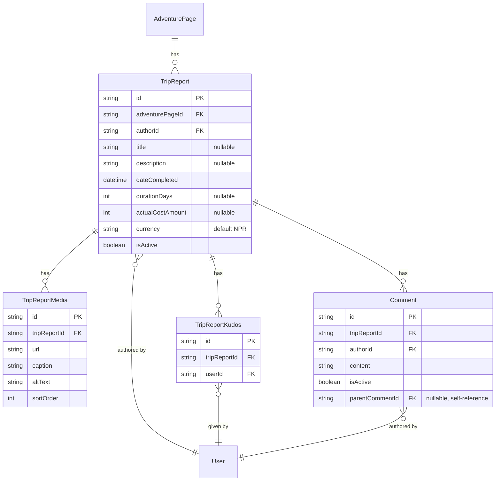

# Trip reports — the social layer

Design for IDEA.md's "Share" pillar and Activity layer (inherited from Strava): "a Strava-style trip reports: what someone actually did, real dates, real costs, kudos/comments." Companion to [ADVENTURE_PAGES.md](ADVENTURE_PAGES.md) (trip reports live on an adventure page's feed) and [MAP_GEODATA.md](MAP_GEODATA.md).

**Status**: built (Phase 8) — public logging/kudos/comments UI on the adventure page view and a trip report permalink page, plus an admin view/delete area (Users beyond master data pass). The multi-currency-cost and threaded-reply gaps this doc originally flagged as open were subsequently closed in Phase 13: `TripReport.currency` and `Comment.parentCommentId` are both live — see the schema and per-table notes below, which now reflect what actually shipped rather than the original Phase 8 design.

## Scope and the one big departure from the content layer

Trip reports get **no verification/trust tier** — no `verificationStatus`, no confirmation table. Everywhere else in the content layer (`AdventurePage`, `Trail`, `Spot`), an unverified → verified pipeline exists because that content is a factual claim other people rely on for planning (is this route safe, is this teahouse real). A trip report isn't that — it's "here's what I did," a personal account. IDEA.md's own wording is "kudos/comments," not a confirmation mechanism, so kudos and comments are the only trust/engagement signal here. This is a deliberate asymmetry with the rest of the schema, not an oversight.

## Schema (additions to `prisma/schema.prisma`)

```prisma
model TripReport {
  id                String   @id @default(uuid())
  adventurePageId   String
  adventurePage     AdventurePage @relation(fields: [adventurePageId], references: [id], onDelete: Cascade)
  authorId          String
  author            User     @relation(fields: [authorId], references: [id], onDelete: Restrict)
  title             String?
  description       String?
  dateCompleted     DateTime
  durationDays      Int?
  actualCostAmount  Int?
  currency          String   @default("NPR") // Phase 13: fixed short list (NPR/USD/EUR/INR), validated in the DTO
  isActive          Boolean  @default(true)
  createdAt         DateTime @default(now())
  updatedAt         DateTime @updatedAt

  media    TripReportMedia[]
  kudos    TripReportKudos[]
  comments Comment[]

  @@map("trip_reports")
}

model TripReportMedia {
  id           String   @id @default(uuid())
  tripReportId String
  tripReport   TripReport @relation(fields: [tripReportId], references: [id], onDelete: Cascade)
  url          String
  caption      String?
  altText      String?
  sortOrder    Int      @default(0)
  createdAt    DateTime @default(now())

  @@map("trip_report_media")
}

model TripReportKudos {
  id           String   @id @default(uuid())
  tripReportId String
  tripReport   TripReport @relation(fields: [tripReportId], references: [id], onDelete: Cascade)
  userId       String
  user         User       @relation(fields: [userId], references: [id], onDelete: Cascade)
  createdAt    DateTime @default(now())

  @@unique([tripReportId, userId])
  @@map("trip_report_kudos")
}

model Comment {
  id           String   @id @default(uuid())
  tripReportId String
  tripReport   TripReport @relation(fields: [tripReportId], references: [id], onDelete: Cascade)
  authorId     String
  author       User       @relation(fields: [authorId], references: [id], onDelete: Restrict)
  content      String
  isActive     Boolean  @default(true)
  createdAt    DateTime @default(now())
  updatedAt    DateTime @updatedAt

  // Phase 13: self-referencing reply thread
  parentCommentId String?
  parentComment    Comment?  @relation("CommentReplies", fields: [parentCommentId], references: [id], onDelete: Cascade)
  replies          Comment[] @relation("CommentReplies")

  @@map("comments")
}
```

## Entity relationships



## Per-table notes

- **`TripReport`**: `onDelete: Cascade` from `adventurePageId` (a trip report is exclusively owned by the page it's logged against, same ownership pattern as `Trail`/`Spot`/`Media`). `onDelete: Restrict` on `authorId` — same reasoning as `PageRevision.editorId`/`Media.uploadedById`: don't lose content by cascading through a hard-deleted user. `dateCompleted` (when the trip happened) is deliberately separate from `createdAt` (when the report was posted) — the same "date posted vs. date the content is actually about" distinction ADVENTURE_PAGES.md draws between `AdventurePage.createdAt` and a revision's `createdAt`.
- **`currency` (Phase 13)** — a fixed short list (`NPR`/`USD`/`EUR`/`INR`) validated in the DTO rather than a Prisma enum, since it's just a display label with no downstream conversion logic (no exchange-rate math anywhere in the platform — a trip logged in USD and one logged in NPR are never compared numerically). Defaults to `NPR` for backward compatibility with rows created before this column existed.
- **`TripReportMedia` is its own table**, not a shared/polymorphic media table with `Media` (which belongs to `AdventurePage`). Prisma has no clean polymorphic-association pattern, and this project has consistently preferred a duplicated-but-simple table over forcing shared shape (see `PageConfirmation`/`TrailConfirmation`/`SpotConfirmation` as three separate tables rather than one generic one). Unlike `Media`, there's no `uploadedById` here — a trip report has exactly one author, so attribution is already on the parent `TripReport`, not needed per-photo.
- **`TripReportKudos`**: a simple like, `@@unique([tripReportId, userId])` stops a user from kudos-ing their own report a hundred times to appear more popular.
- **`Comment.parentCommentId` (Phase 13)** — a self-referencing FK, same shape as `ActivityType`'s parent/child hierarchy, `onDelete: Cascade` (deleting a comment takes its replies with it — there's no orphaned-reply state to reason about). The service fetches a trip report's comments flat and builds the reply tree in application code (`CommentsService.listForTripReport`), not via recursive SQL — the reply depth here is small enough that a recursive CTE would be premature. `isActive` still gives moderators a way to hide a comment without hard-deleting it, same reasoning as everywhere else: undo is flipping a flag, not losing data.

## Required additions to existing models

| Existing model | Field to add |
|---|---|
| `AdventurePage` | `tripReports TripReport[]` |
| `User` | `tripReports TripReport[]`, `tripReportKudos TripReportKudos[]`, `comments Comment[]` |

Not added retroactively now, same reasoning as ADVENTURE_PAGES.md/MAP_GEODATA.md's equivalent tables.
